

<b>ESPECIFICACIÓN DE REQUISITOS DE SOFTWARE</b>

<b>PROYECTO: SISTEMA CONTABLE Y DE FACTURACIÓN ELECTRÓNICA</b>

<b>VISIÓN CLARA S.A.S.</b>

<b>FICHA 3410390</b>

<b>JUAN CAMILO GIL PEREZ</b>

<b>JOSE GERMAN ESTRADA</b>

<b>SERVICIO NACIONAL DE APRENDIZAJE (SENA)</b>

<b>CENTRO DE PROCESOS INDUSTRIALES Y CONSTRUCCION</b>

<b>TECNOLOGIA EN ANALISIS Y DESARROLLO DE SOFTWARE</b>

<b>DIAGRAMAS DE FLUJO DE LOS CASOS DE USO</b>

##### FICHA DEL DOCUMENTO

| FECHA | REVISIÓN(ES) | AUTOR(ES) |
|-------|--------------|-----------|
| 20/06/2026 | V1.0 | Juan Camilo Gil Perez |

---

# DIAGRAMAS DE FLUJO DE CASOS DE USO

Este documento contiene los **16 diagramas de flujo** de los casos de uso definidos en la sección **4.1.1 Definición del caso de uso** de `IEEE.md`. Cada diagrama modela el **escenario principal** en Mermaid (`flowchart TD`), con la siguiente convención:

| Elemento | Significado |
|---|---|
| Rectángulo | Paso del flujo principal |
| Rombo (decisión) | Validación dentro del flujo principal |

---

## ÍNDICE DE CASOS DE USO

| # | Caso de uso | Código |
|---|---|---|
| 1 | Inicio de sesión en el sistema | LOGIN-001 |
| 2 | Registrar usuario en el sistema | REGISTRO-001 |
| 3 | Recuperar clave de usuario | RECCLA-001 |
| 4 | Recuperar nombre de usuario | RECUUS-001 |
| 5 | Cambiar contraseña de forma periódica | CAMC-001 |
| 6 | Registrar producto en inventario | REGPI-001 |
| 7 | Actualizar stock de producto | CTSI-001 |
| 8 | Consultar inventario | CONSULI-001 |
| 9 | Registrar venta en el sistema | REGISVEN-001 |
| 10 | Anular venta en el sistema | ANULAVEN-001 |
| 11 | Registrar cliente en el sistema | REGISCLI-001 |
| 12 | Consultar cliente en el sistema | CONSULCLI-001 |
| 13 | Registrar proveedor en el sistema | REGISPROV-001 |
| 14 | Consultar proveedor en el sistema | CONSULPROV-001 |
| 15 | Generar reporte de inventario | REPORTEINV-001 |
| 16 | Generar reporte de ventas | REPORTEVENTAS-001 |

---

## 1. INICIO DE SESIÓN EN EL SISTEMA

### CASO DE USO 1

| CÓDIGO | NOMBRE |
|---|---|
| LOGIN-001 | Login del sistema |

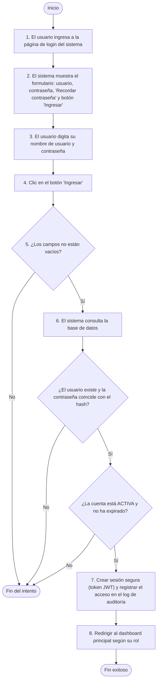

---
## 2. REGISTRAR USUARIO EN EL SISTEMA

### CASO DE USO 2

| CÓDIGO | NOMBRE |
|---|---|
| REGISTRO-001 | Registrar usuario en el sistema |

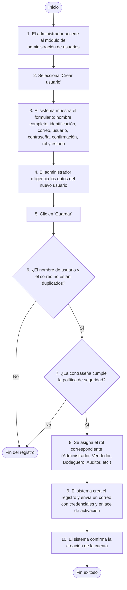

---
## 3. RECUPERAR CLAVE DE USUARIO

### CASO DE USO 3

| CÓDIGO | NOMBRE |
|---|---|
| RECCLA-001 | Recuperar contraseña olvidada |

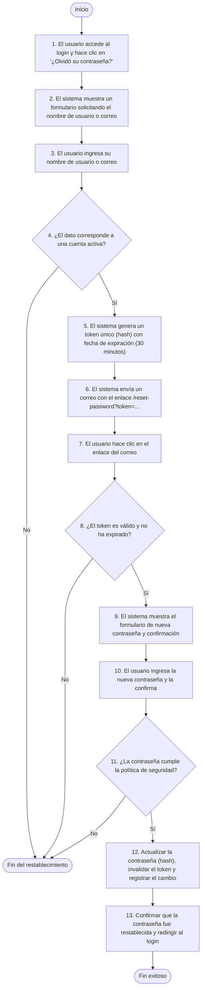

---
## 4. RECUPERAR USUARIO DEL SISTEMA

### CASO DE USO 4

| CÓDIGO | NOMBRE |
|---|---|
| RECUUS-001 | Recuperar nombre de usuario olvidado |

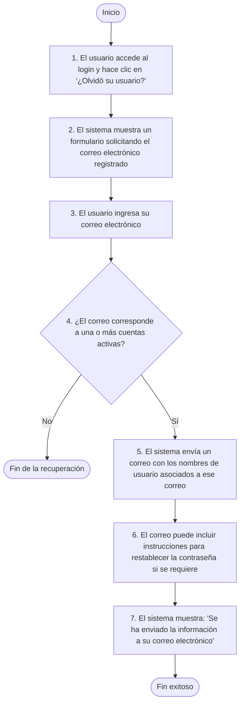

---
## 5. CAMBIAR CONTRASEÑA DE FORMA PERIÓDICA

### CASO DE USO 5

| CÓDIGO | NOMBRE |
|---|---|
| CAMC-001 | Cambiar contraseña de manera periódica por seguridad informática |

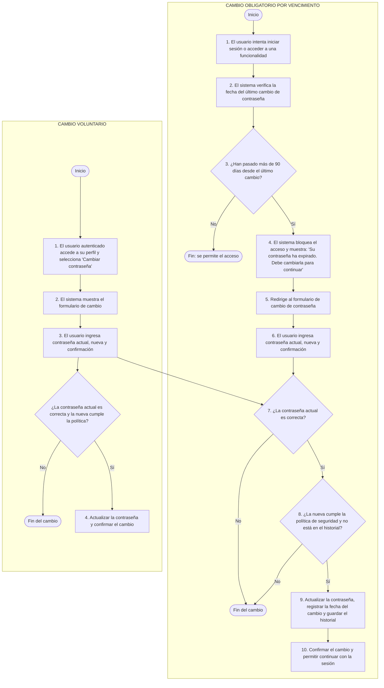

---
## 6. REGISTRAR PRODUCTO EN INVENTARIO

### CASO DE USO 6

| CÓDIGO | NOMBRE |
|---|---|
| REGPI-001 | Registrar producto |

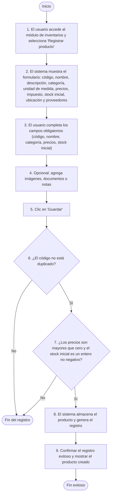

---
## 7. ACTUALIZAR STOCK DE PRODUCTO

### CASO DE USO 7

| CÓDIGO | NOMBRE |
|---|---|
| CTSI-001 | Actualizar stock de producto |

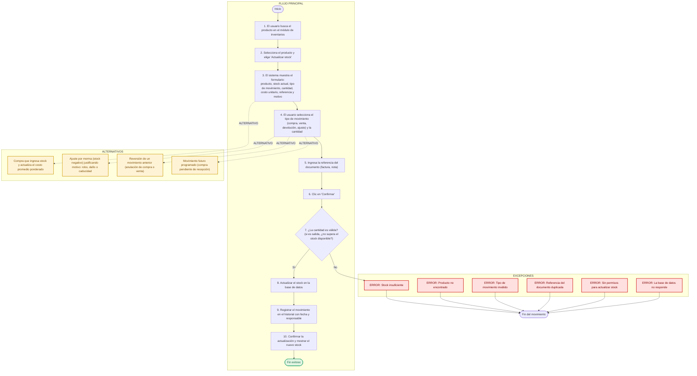

---
## 8. CONSULTAR INVENTARIO

### CASO DE USO 8

| CÓDIGO | NOMBRE |
|---|---|
| CONSULI-001 | Consultar inventario |

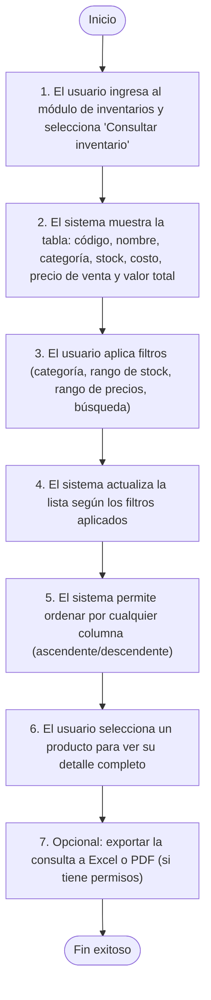

---
## 9. REGISTRAR VENTA EN EL SISTEMA

### CASO DE USO 9

| CÓDIGO | NOMBRE |
|---|---|
| REGISVEN-001 | Registrar venta |

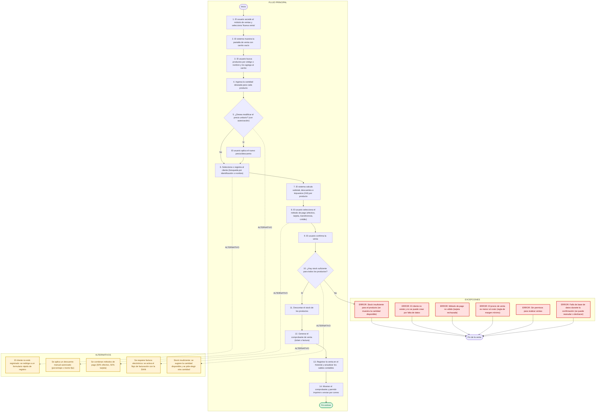

---
## 10. ANULAR VENTA EN EL SISTEMA

### CASO DE USO 10

| CÓDIGO | NOMBRE |
|---|---|
| ANULAVEN-001 | Anular venta |

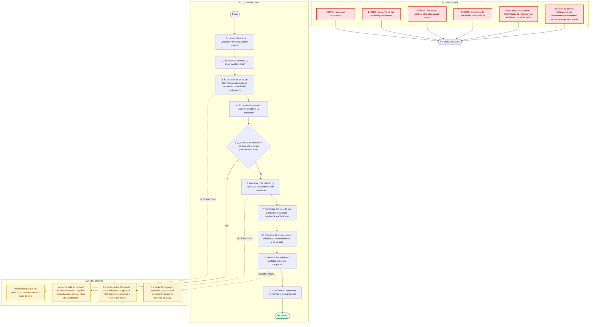

---
## 11. REGISTRAR CLIENTE EN EL SISTEMA

### CASO DE USO 11

| CÓDIGO | NOMBRE |
|---|---|
| REGISCLI-001 | Registrar cliente |

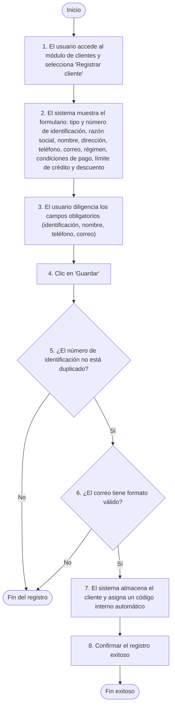

---
## 12. CONSULTAR CLIENTE EN EL SISTEMA

### CASO DE USO 12

| CÓDIGO | NOMBRE |
|---|---|
| CONSULCLI-001 | Consultar cliente |

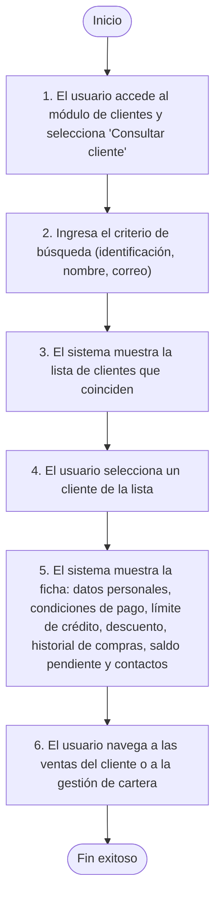

---
## 13. REGISTRAR PROVEEDOR EN EL SISTEMA

### CASO DE USO 13

| CÓDIGO | NOMBRE |
|---|---|
| REGISPROV-001 | Registrar proveedor |

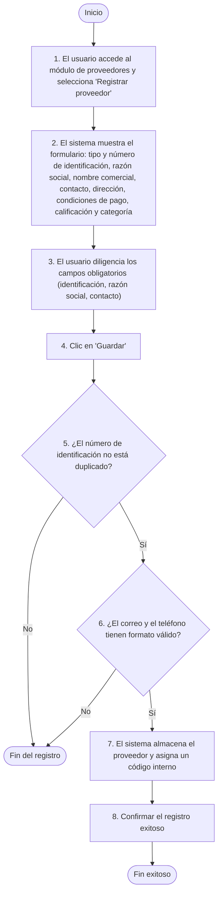

---
## 14. CONSULTAR PROVEEDOR EN EL SISTEMA

### CASO DE USO 14

| CÓDIGO | NOMBRE |
|---|---|
| CONSULPROV-001 | Consultar proveedor |

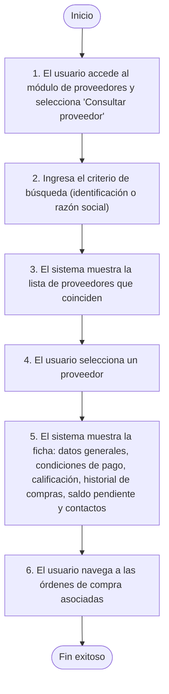

---
## 15. GENERAR REPORTE DE INVENTARIO

### CASO DE USO 15

| CÓDIGO | NOMBRE |
|---|---|
| REPORTEINV-001 | Generar reporte de inventario |

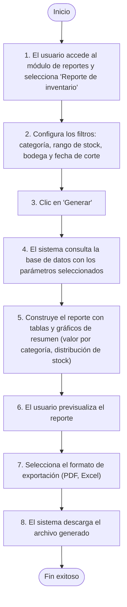

---
## 16. GENERAR REPORTE DE VENTAS

### CASO DE USO 16

| CÓDIGO | NOMBRE |
|---|---|
| REPORTEVENTAS-001 | Generar reporte de ventas |

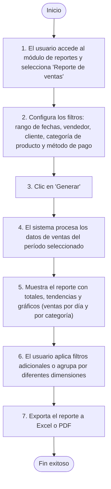

---

## NOTA DE TRAZABILIDAD

Los flujos anteriores se derivan textualmente del campo **ESCENARIO PRINCIPAL** de cada caso de uso documentado en `IEEE.md` (sección 4.1.1, líneas 938-1278). Cada diagrama puede renderizarse en cualquier visor compatible con Mermaid 11.x (GitHub, Typora, o el `mermaid.min.js` incluido en el proyecto).