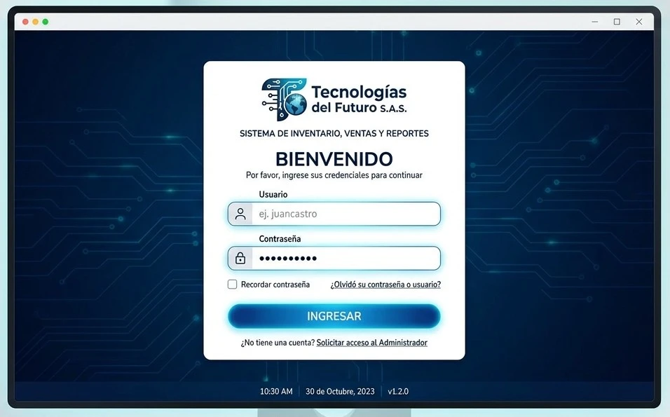
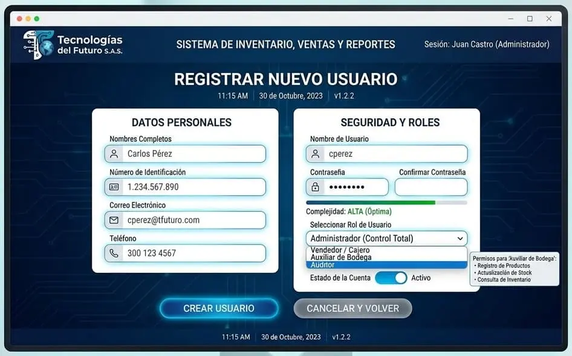
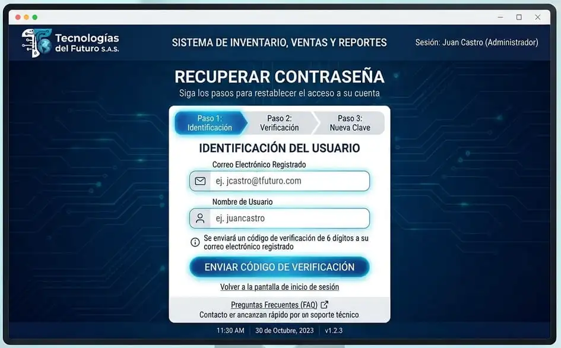
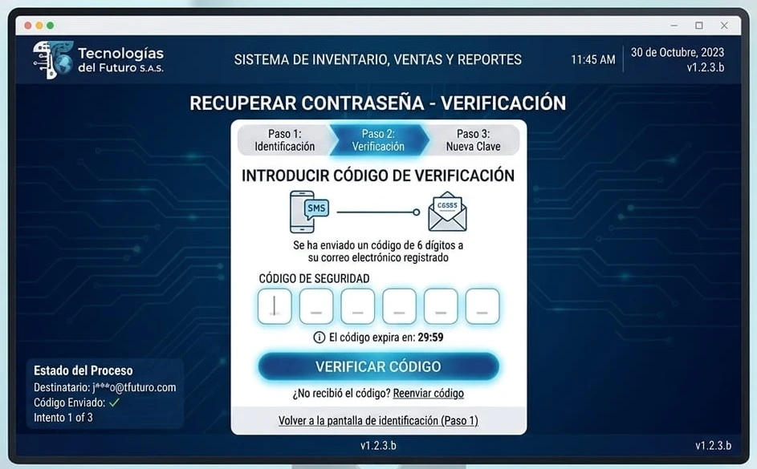
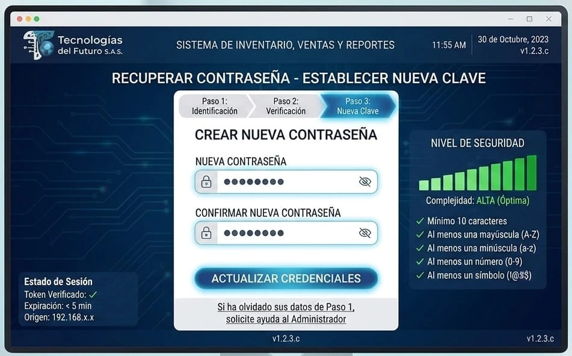
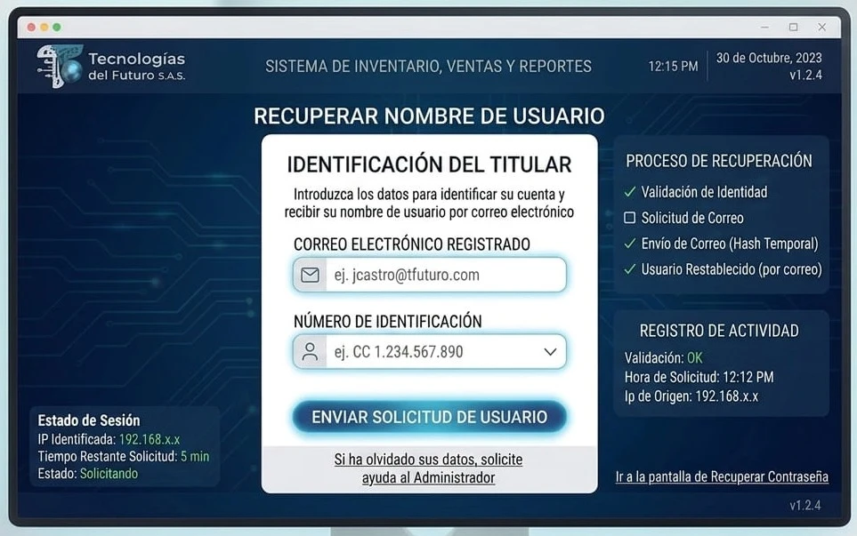
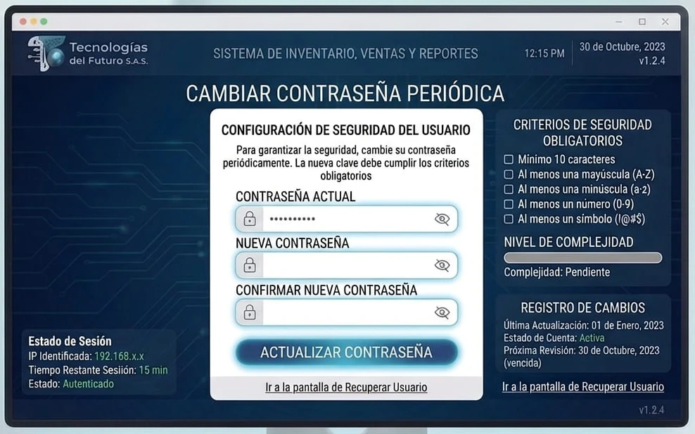
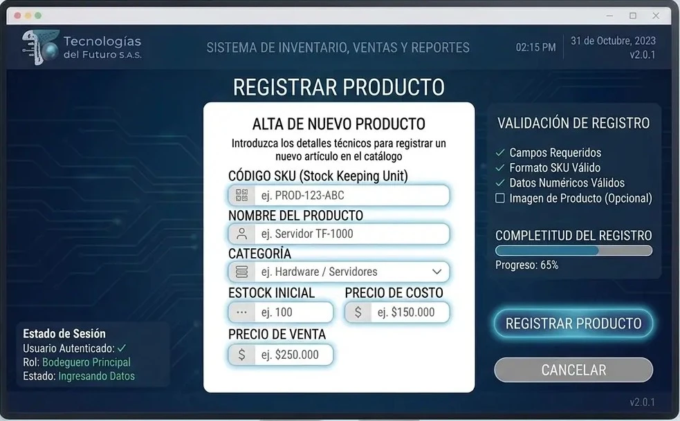

<b>ESPECIFICACIÓN DE REQUISITOS DE SOFTWARE</b>

<b>PROYECTO: SISTEMA CONTABLE Y DE FACTURACIÓN ELECTRÓNICA</b>

<b>VISIÓN CLARA S.A.S.</b>

<b>FICHA 3410390</b>

<b>JUAN CAMILO GIL PEREZ</b>

<b>JOSE GERMAN ESTRADA</b>

<b>SERVICIO NACIONAL DE APRENDIZAJE (SENA)</b>

<b>CENTRO DE PROCESOS INDUSTRIALES Y CONSTRUCCION</b>

<b>TECNOLOGIA EN ANALISIS Y DESARROLLO DE SOFTWARE</b>

<b>ETAPA DE ELICITACION DE REQUISITOS</b>

<b>FORMACION PRESENCIAL JORNADA DE LA MAÑANA</b>

<b>20 DE JUNIO 2026</b>

##### FICHA DEL DOCUMENTO

| FECHA | REVISIÓN(ES) | AUTOR(ES) |
|-------|--------------|-----------|
| 20/06/2026 | V1.0 | Juan Camilo Gil Perez |
| 30/07/2026 | V1.1 | Juan Camilo Gil Perez |
| 13/08/2026 | V1.2 | Juan Camilo Gil Perez |
| 20/08/2026 | V1.3 | Juan Camilo Gil Perez |
| 25/08/2026 | V1.4 | Juan Camilo Gil Perez |
| | | |

---

##### DOCUMENTO VALIDADO POR LAS PARTES EN FECHA:

| POR CLIENTE | DESARROLLADOR |
|-------------|---------------|
| FECHA: 20/06/2026 | FECHA: 20/06/2026 |
| NOMBRE DEL ENCARGADO: Jose Germán Estrada | NOMBRE DEL ENCARGADO: Juan Camilo Gil Perez|

| POR CLIENTE | DESARROLLADOR |
|-------------|---------------|
| FECHA: 30/07/2026 | FECHA: 30/07/2026 |
| NOMBRE DEL ENCARGADO: Jose Germán Estrada | NOMBRE DEL ENCARGADO: Juan Camilo Gil Perez|

| POR CLIENTE | DESARROLLADOR |
|-------------|---------------|
| FECHA: 13/08/2026 | FECHA: 13/08/2026 |
| NOMBRE DEL ENCARGADO: Jose Germán Estrada | NOMBRE DEL ENCARGADO: Juan Camilo Gil Perez|

| POR CLIENTE | DESARROLLADOR |
|-------------|---------------|
| FECHA: 20/08/2026 | FECHA: 20/08/2026 |
| NOMBRE DEL ENCARGADO: Jose Germán Estrada | NOMBRE DEL ENCARGADO: Juan Camilo Gil Perez|

| POR CLIENTE | DESARROLLADOR |
|-------------|---------------|
| FECHA: 25/08/2026 | FECHA: 25/08/2026 |
| NOMBRE DEL ENCARGADO: Jose Germán Estrada | NOMBRE DEL ENCARGADO: Juan Camilo Gil Perez|
---

##### CONTENIDO

1. INTRODUCCION
   1.1. OBJETIVO GENERAL
   1.2. OBJETIVOS ESPECIFICOS
   1.3. PROPOSITO
   1.4. ALCANCE
   1.5. PERSONAL INVOLUCRADO
   1.6. DEFINICIONES, ACRONIMOS Y ABREVIATURAS
   1.7. REFERENCIAS
   1.8. RESUMEN
2. DESCRIPCION GENERAL
   2.1. PERSPECTIVA DEL PRODUCTO
   2.2. FUNCIONALIDADES DEL PRODUCTO
   2.3. CARACTERISTICAS DE LOS USUARIOS
   2.4. RESTRICCIONES
3. REQUISITOS ESPECIFICOS
   3.1. REQUISITOS DEL SISTEMA
   3.2. REQUISITOS FUNCIONALES
   3.3. REQUISITOS NO FUNCIONALES
4. VALIDACIÓN DE REQUISITOS
   4.1. CONSTRUCCIÓN DE PROTOTIPOS
   4.2. FORMATO DE CASO DE PRUEBA

---

## 1. INTRODUCCION

*(Contexto del negocio y necesidad de digitalización contable)*

Visión Clara S.A.S. es una empresa especializada en la comercialización y adaptación de gafas y dispositivos de asistencia visual para personas con discapacidad visual (baja visión y ceguera). La empresa opera con 3 sedes físicas (Centro, Norte, Occidente) y una tienda virtual, atendiendo tanto a EPS y hospitales (B2B) como a clientes finales.

Actualmente, la empresa enfrenta desafíos significativos en su gestión contable y financiera: el proceso de contabilización manual toma 3 días completos a la semana, el cierre mensual se extiende hasta 15 días, y la facturación electrónica presenta devoluciones de la DIAN que afectan el flujo de caja. Se requiere un sistema que automatice estos procesos y proporcione visibilidad en tiempo real de la rentabilidad por producto y por sede.

##### 1.1. OBJETIVO GENERAL

Desarrollar e implementar un sistema contable y de facturación electrónica integral que permita a Visión Clara S.A.S. automatizar sus procesos financieros, cumplir con los requisitos de la DIAN, y proporcionar información en tiempo real para la toma de decisiones estratégicas, mejorando la eficiencia operativa y la rentabilidad del negocio.

##### 1.2. OBJETIVOS ESPECIFICOS

- Automatizar el proceso de facturación electrónica con envío en tiempo real a la DIAN y obtención del CUFE.
- Centralizar la gestión contable incluyendo cuentas por cobrar, cuentas por pagar, inventarios, nómina y activos fijos.
- Implementar un sistema de inventarios con costeo promedio ponderado y control de costos por producto/lote.
- Generar reportes financieros estándar (Balance, P&G, Flujo de Caja) y personalizables por sede y línea de producto.
- Reducir el tiempo de cierre contable mensual de 15 días a 3 días.
- Garantizar el cumplimiento de las obligaciones tributarias (IVA, Renta, Retención, Exógena) mediante generación automática de archivos planos.

##### 1.3. PROPOSITO

*(Que finalidad tiene el software frente a la necesidad de automatización contable y cumplimiento DIAN)*

El software tiene como propósito principal ser la herramienta de gestión financiera diaria de Visión Clara S.A.S., permitiendo al equipo contable pasar de una contabilidad "reactiva" a una "predictiva" en tiempo real. La finalidad es eliminar el tipeo manual de asientos, reducir errores en la liquidación de retenciones e IVA, y proporcionar dashboards actualizados que permitan tomar decisiones informadas sobre compras de inventario y gestión de cartera.

##### 1.4. ALCANCE

*(Que tan lejos va a abarcar el software en las funciones de la empresa)*

El sistema abarcará las siguientes áreas de la empresa:

- **Facturación Electrónica:** Generación de Factura Electrónica de Venta, Nota Débito, Nota Crédito y Documento Soporte, con envío en tiempo real a la DIAN.
- **Gestión Contable:** Plan de cuentas (PUC) personalizable, asientos contables automáticos y manuales, cierre mensual y anual.
- **Cuentas por Cobrar y Pagar:** Gestión de cartera con antigüedad de saldos, gestión de proveedores con retenciones y fechas de pago.
- **Inventarios:** Control de inventarios con costeo promedio ponderado, ajustes por mermas y toma física.
- **Activos Fijos:** Gestión de equipos de diagnóstico visual (lentómetros, autorrefractores) con depreciación por línea recta.
- **Nómina:** Registro de nómina integrada con seguridad social.
- **Reportes y Analytics:** Dashboard con KPIs en tiempo real, reportes financieros estándar y personalizables, exportación a Excel, PDF y CSV.
- **Declaraciones Tributarias:** Generación de archivos planos para IVA (formato 300), Renta, Retención (formato 350) y Exógena.

**Quedan fuera del alcance en esta primera fase:**
- Gestión de citas médicas e historial clínico (permanece en CRM/Salesforce).
- Gestión de bodegas logísticas avanzadas (solo costo y saldo).
- Facturación de nómina electrónica (se evalúa para fase 2).
- Módulo de RRHH completo.

##### 1.5. PERSONAL Involucrado *(Puede ser 1 persona o varias)*

| NOMBRE | Carlos Mendoza |
|--------|----------------|
| **ROL** | Gerente General / Propietario |
| **PROFESION** | Administrador de Empresas |
| **RESPONSABILIDADES** | Aprobación de presupuestos, decisiones estratégicas, validación del sistema |
| **INFORMACION DE CONTACTO** | Celular: [Número] - Correo: [Correo] |
| **APRUEBA** | *(Aprueba entrevista y seguimiento) SI/NO* |

##### 1.6. DEFINICIONES, ACRONIMOS Y ABREVIATURAS

| TÉRMINO | DEFINICIÓN / SIGNIFICADO |
|---------|--------------------------|
| CUFE | Código Único de Factura Electrónica - Identificador de la DIAN |
| CUDE | Código Único de Documento Electrónico - Identificador de notas y otros documentos |
| PUC | Plan Único de Cuentas - Estándar contable colombiano |
| RUT | Registro Único Tributario - Identificación fiscal en Colombia |
| EPS | Entidad Promotora de Salud - Clientes institucionales |
| B2B | Business to Business - Ventas a empresas |
| KPI | Indicador Clave de Rendimiento - Métrica para evaluar el éxito |
| MUISCA | Portal de la DIAN para declaraciones tributarias |
| FOSYGA | Fondo de Solidaridad y Garantía - Entidad estatal de salud |
| WAF | Web Application Firewall - Firewall a nivel de aplicación |
| RTO | Recovery Time Objective - Tiempo objetivo de recuperación |
| RPO | Recovery Point Objective - Punto objetivo de recuperación |

##### 1.7. REFERENCIAS

*(Ejemplos de software que resuelven necesidades similares)*

- **SIIGO Nube:** Software contable actualmente utilizado, se desea reemplazar por su rigidez y lentitud en integración DIAN.
- **Odoo:** Evaluado por su flexibilidad técnica, pero rechazado por requerir demasiados módulos externos para el tratamiento fiscal colombiano.
- **Nómina Software:** Evaluado pero considerado muy básico para el control de inventarios de alto valor.

##### 1.8. RESUMEN

*(Breve resumen del uso del software, para que se usa)*

El sistema contable y de facturación electrónica es una herramienta integral diseñada para automatizar la gestión financiera de Visión Clara S.A.S. El software permite generar y enviar facturas electrónicas a la DIAN, gestionar inventarios de productos de alto valor, administrar cartera y proveedores, y generar reportes financieros en tiempo real. Su uso diario está previsto para el equipo contable, el gerente general y personal administrativo, facilitando el cumplimiento tributario y la toma de decisiones estratégicas basadas en datos.

---

## 2. DESCRIPCION GENERAL

*(A groso modo la descripción del software en funcionamiento, como se usa o funciona)*

El software contable y de facturación electrónica es una aplicación web (SaaS) alojada en la nube (AWS o Azure), accesible desde navegador y con versión móvil (PWA) para aprobaciones rápidas. La plataforma está diseñada con una interfaz simple y rápida para el día a día, con la capacidad de desplegar opciones avanzadas para la contabilidad.

El sistema se organiza en módulos interconectados: Facturación Electrónica, Contabilidad, Cartera, Proveedores, Inventarios, Activos Fijos, Nómina, Reportes y Declaraciones Tributarias. Cada módulo permite el registro, consulta, edición y generación de reportes con trazabilidad completa de todas las acciones realizadas.

##### 2.1. PERSPECTIVA DEL PRODUCTO

*(Como se describe la interfaz del sistema, con las que él usuario interactúa con el sistema y cuales usuarios lo usarán y bajo que roles)*

El sistema se presenta como una aplicación web (responsive) con las siguientes características de interfaz:

- **Dashboard ejecutivo:** Resumen con KPIs en tiempo real: Ventas del día, Cartera vencida > 60 días, Margen bruto del mes, Efectivo disponible, Facturas pendientes por enviar a DIAN.
- **Menú de navegación:** Acceso rápido a todos los módulos (Facturación, Contabilidad, Cartera, Proveedores, Inventarios, Activos Fijos, Reportes, Declaraciones).
- **Buscador inteligente:** Búsqueda rápida por cliente, factura, producto o asiento contable.
- **Formularios optimizados:** Registro de facturas con validación de reglas (precios, IVA) y envío en tiempo real a la DIAN.
- **Reportes y gráficos:** Visualización de datos en tablas, gráficos de barras, líneas y dashboards interactivos.
- **Alertas y notificaciones:** Sistema de alarmas automáticas para facturas rechazadas, vencimiento de certificado digital, inventario bajo, etc.

**Usuarios y roles:**

| ROL | DESCRIPCIÓN | NIVEL DE ACCESO |
|-----|-------------|-----------------|
| **Administrador** | Gerente General y Gerente Financiero | Acceso total a todos los módulos y configuraciones |
| **Contador Jefe** | Profesional contable con alto conocimiento | Todo contable y reportes, parametrización de impuestos |
| **Auxiliar Contable** | Personal de facturación, cartera y proveedores | Solo facturación, cartera y proveedores, sin modificar parametrizaciones |
| **Auditor Externo** | Contador externo para revisiones | Solo lectura de todos los módulos |

##### 2.2. FUNCIONALIDADES DEL PRODUCTO *(Elicitación)*

*(Enumerar todas y cada una de las funciones que pide el cliente para su proyecto de automatización)*

**PREGUNTAS PARA EL PROCESO DE ELICITACIÓN DE REQUISITOS**

**CATEGORÍA 1: CONTEXTO GENERAL DEL PROYECTO (Preguntas #1 - #4)**

**1. ¿Cuál es la principal necesidad o problema que este software contable debe resolver para la organización?**
La principal necesidad es controlar el costo de ventas y la rentabilidad por producto/lote (los lentes y dispositivos electrónicos de asistencia son costosos) y automatizar la facturación electrónica para evitar devoluciones de la DIAN que nos frenen el flujo de caja con las EPS.

**2. ¿Qué espera lograr la empresa con la implementación de este nuevo sistema contable?**
Esperamos pasar de una contabilidad "reactiva" (donde nos damos cuenta de pérdidas al mes siguiente) a una contabilidad "predictiva" en tiempo real, que nos permita saber al instante el margen de cada orden de venta y el estado de cobranza a las clínicas.

**3. ¿Cómo impactará este software en los procesos contables y financieros actuales?**
Impactará eliminando por completo el tipeo manual de asientos contables (que actualmente nos toma 3 días completos a la semana) y reduciendo los errores humanos en la liquidación de retenciones e IVA, agilizando el cierre mensual de 15 días a solo 3 días.

**4. ¿Quién será el usuario final principal del sistema y qué beneficio directo obtendrá?**
El usuario final principal será mi Contador Líder (Jefe de Finanzas). Su beneficio directo será dejar de ser un "digitador" para convertirse en un analista de datos, teniendo dashboards actualizados para tomar decisiones de compra de inventario.

---

**CATEGORÍA 2: ALCANCE Y PROCESOS CONTABLES (Preguntas 5 - 8)**

**5. ¿Qué procesos contables específicos (ej. cuentas por pagar, cobrar, inventarios, nómina) debe cubrir el software?**
Debe cubrir: Cuentas por Pagar (a proveedores internacionales de lentes), Cuentas por Cobrar (especialmente cartera a EPS con +60 días), Inventarios (con costeo promedio ponderado), Nómina (integrada con seguridad social) y Activos Fijos (equipos de diagnóstico visual).

**6. ¿Qué procesos contables actuales no serán cubiertos por el sistema en esta primera fase?**
En esta primera fase, NO cubriremos la gestión de citas médicas ni el historial clínico de los pacientes (eso queda en nuestro CRM médico). Tampoco cubriremos la gestión de bodegas logísticas avanzadas (solo el costo y saldo).

**7. ¿El software interactuará con otros sistemas existentes en la empresa (ej. ERP, CRM, sistemas de nómina)?**
Sí, debe interactuar con nuestro CRM/Sistema de Ventas (actualmente Salesforce) para traer los datos del cliente (NIT, razón social) y con la plataforma de la DIAN (obligatorio). También debe exportar archivos planos para nuestra entidad bancaria (conciliación).

**8. ¿Se requiere que el software maneje múltiples empresas o sedes?**
Sí. Debemos manejar 3 sedes (Centro, Norte, Occidente) y también manejar la opción de "empresa virtual" para la tienda e-commerce, pero el NIT es único. Necesito ver los resultados por sede (centro de costo).

---

**CATEGORÍA 3: DEFINICIONES, ACRÓNIMOS Y REFERENCIAS (Preguntas 9 - 15)**

**9. ¿Qué términos contables específicos de la empresa o del sector se deben considerar?**
Términos clave: "Lente oftálmico terminado" (producto final), "Ayuda óptica" (no invasiva), "Facturación a EPS" (régimen especial de facturación), y "Devolución en garantía" (créditos por lentes defectuosos).

**10. ¿Qué acrónimos de la DIAN (ej. CUFE, CUDE, XML, firma electrónica) son de uso común y deben ser manejados por el sistema?**
Manejamos CUFE, CUDE, XML, ZIP, Firma Electrónica (Token), Resolución de Facturación y el RUT. Debemos gestionar las notas de crédito y débito electrónicas.

**11. ¿Existe un glosario interno de términos que debamos usar como referencia?**
No tenemos un glosario formal impreso; lo definiremos juntos durante el relevamiento para estandarizar el lenguaje entre el equipo de desarrollo y mi equipo contable.

**12. ¿Cómo se refieren internamente a los diferentes tipos de documentos (factura, nota crédito, débito, etc.)?**
Actualmente llamamos a las facturas B2B "Facturas EPS", a las de venta directa "Factura de mostrador", y a las notas crédito "NC - Devolución de paciente". Queremos mantener esta nomenclatura.

**13. ¿Qué software contable se utiliza actualmente y qué aspectos del mismo se desean conservar o mejorar?**
Usamos actualmente SIIGO Nube, pero es muy rígido para la parametrización de centros de costo y su integración con la DIAN es lenta; queremos mejorar la velocidad de envío y la capacidad de personalizar reportes de rentabilidad por tipo de gafa.

**14. ¿Qué software de la competencia han evaluado y por qué no cumplen con sus expectativas?**
Evaluamos Odoo (nos pareció excelente técnicamente, pero la implementación contable en Colombia con la DIAN requieren demasiados módulos externos y no nos daba confianza la estabilidad) y Nómina Software (muy básico para el control de inventarios de alto valor). No cumplieron porque ninguno ofrecía una solución integral "todo en uno" con el tratamiento fiscal colombiano nativo.

**15. ¿Existen documentos, manuales o procedimientos internos que describan el flujo contable actual?**
Sí, tenemos procedimientos internos en Excel donde describimos el "Flujo de la factura" y el "Cierre de caja diario". Se los entregaremos al equipo de desarrollo para que entiendan nuestros pasos actuales.

---

**CATEGORÍA 4: VISIÓN GENERAL Y CRONOGRAMA (Preguntas 16 - 20)**

**16. Si tuviera que describir el software en una sola frase, ¿cuál sería?**
"El sistema financiero que nos da paz mental ante la DIAN y claridad absoluta de nuestra rentabilidad real por cada producto que vendemos."

**17. ¿Cuál es el "corazón" del negocio para este sistema?**
El "corazón" del negocio para este sistema es el módulo de facturación electrónica y su contabilización automática, porque si la factura falla, no cobramos. En segundo lugar, el control de inventarios.

**18. ¿Qué funcionalidad es crítica y debe funcionar perfectamente desde el primer día?**
Funcionalidad crítica desde el día 1: La generación y envío de facturas electrónicas con su respectiva firma digital y obtención del CUFE. Si el software no factura, la empresa se detiene.

**19. ¿Cuál es el cronograma esperado para la implementación y puesta en marcha del software?**
Cronograma esperado: 4 a 5 meses para la versión funcional (con facturación e inventarios), y 1 mes adicional de pruebas paralelas (usando el sistema en paralelo con SIIGO). Puesta en marcha definitiva en 6 meses.

**20. ¿Cuál es el presupuesto estimado para este proyecto?**
Presupuesto estimado: $180.000.000 a $220.000.000 COP (incluyendo capacitaciones y el primer año de soporte y mantenimiento). No podemos exceder los $250M sin aprobación de la junta.

---

**CATEGORÍA 5: USUARIOS, ROLES E INTERFAZ (Preguntas 21 - 24)**

**21. Describa un día típico de trabajo para un contador usando este software. ¿Cuáles serían sus primeras acciones?**
Un día típico: 8:00 a.m. revisar el dashboard de facturas rechazadas por la DIAN, validar las órdenes de venta pendientes de contabilizar, ejecutar el cierre de caja de las 3 sedes del día anterior, y a medio día revisar las cuentas por cobrar vencidas para llamar a las EPS.

**22. ¿Qué roles de usuario existirán y qué nivel de acceso debe tener cada uno?**
Roles: Administrador (yo y mi Gerente Financiero - acceso total), Contador Jefe (todo contable y reportes), Auxiliar Contable (solo facturación, cartera y proveedores, sin poder modificar parametrizaciones), Auditor Externo (solo lectura de todos los módulos).

**23. ¿Cómo debería ser la interfaz de usuario: simple y rápida, o detallada y con muchas opciones?**
Interfaz: Simple y rápida para el día a día (facturación y caja), pero con la posibilidad de desplegar opciones avanzadas para la contabilidad. Odio las interfaces recargadas; prefiero un diseño limpio tipo "command palette" o barra de búsqueda inteligente.

**24. ¿El sistema debe estar disponible en dispositivos móviles o solo en computadores de escritorio?**
Debe estar disponible principalmente en escritorio (web) para el contador, pero necesito una versión móvil (PWA o App) para que yo pueda aprobar órdenes de pago o revisar el saldo de caja desde cualquier lugar.

---

**CATEGORÍA 6: FUNCIONALIDADES PRINCIPALES DEL SOFTWARE (Preguntas 25 - 31)**

**25. Enumere las 5 funcionalidades más importantes que el software debe tener.**
Top 5: (1) Facturación Electrónica DIAN (envío/aceptación), (2) Módulo de Inventarios con costo promedio y ajustes, (3) Cartera (Clientes) y Proveedores, (4) Generación de declaraciones (IVA, Renta, Retención), (5) Reportes financieros base (Balance, P&G).

**26. ¿Cómo se manejará el ciclo de vida de una factura: desde su creación, envío a la DIAN, hasta su contabilización y pago?**
Ciclo de vida de factura: Creación desde CRM/Manual -> Validación de reglas (precios, IVA) -> Firma y envío a DIAN en tiempo real -> Recepción CUFE -> Contabilización automática (asiento) -> Estado "Por Cobrar" -> Al recibir el pago, se aplica a la cartera.

**27. ¿Se requiere un módulo de cartera (cuentas por cobrar) y otro de proveedores (cuentas por pagar)?**
Sí, absolutamente obligatorios. El módulo de cartera debe tener gestión de cobranzas por antigüedad de saldos. El de proveedores debe gestionar las fechas de pago y las retenciones de ley.

**28. ¿El sistema debe llevar un control de inventarios y su correspondiente costo?**
Sí, es un requisito no negociable. Al ser gafas de alta tecnología (algunas superan los $2 millones), debo saber el costo unitario exacto al vender. Soporte para inventario físico (toma física) y ajustes por mermas.

**29. ¿Se necesita un módulo para la gestión de activos fijos?**
Sí, necesito un módulo sencillo para gestionar lentómetros, autorrefractores y computadores de diagnóstico (activos fijos), con depreciación por línea recta y su respectivo asiento mensual.

**30. ¿Qué tipo de reportes financieros son indispensables (ej. Balance General, Estado de Resultados, Flujo de Caja)?**
Indispensables: Balance General, Estado de Resultados (P&G), Flujo de Efectivo (método directo e indirecto), y un reporte de Rentabilidad por Sucursal.

**31. ¿El software debe generar los archivos planos para las declaraciones tributarias (ej. IVA, Renta)?**
Sí, absolutamente. El software debe generar los archivos planos de IVA (formato 300), Renta (personas jurídicas), Retención en la fuente (formato 350) y Exógena. No quiero hacerlos a mano en el MUISCA.

---

**CATEGORÍA 7: CARACTERÍSTICAS DE LOS USUARIOS Y SOPORTE (Preguntas 32 - 35)**

**32. ¿Qué nivel de conocimiento contable y tecnológico tienen los usuarios finales?**
Mi equipo contable tiene alto conocimiento contable (son profesionales) pero nivel tecnológico intermedio; les cuesta adaptarse a cambios bruscos de interfaz, necesitan flujos de trabajo muy lógicos.

**33. ¿Qué tipo de formación o capacitación necesitarán para usar el sistema eficazmente?**
Necesitarán capacitación práctica (talleres hands-on) durante 2 semanas seguidas, simulando un mes de cierre completo. Prefiero videos tutoriales cortos (máx 5 min) integrados en el sistema para consultas rápidas.

**34. ¿Con qué frecuencia y en qué horarios suelen trabajar los contadores en el sistema?**
Trabajan en horario comercial (8 a.m. a 6 p.m.), pero durante los cierres mensuales (últimos 5 días del mes) pueden trabajar hasta las 9 p.m. El sistema debe permitir trabajo fuera de horario sin caídas.

**35. ¿Existe un departamento de TI interno que pueda dar soporte de primer nivel?**
Tenemos un equipo de TI interno de 3 personas, pero su enfoque es infraestructura y redes. Solo podrán dar soporte de primer nivel (reseteo de contraseñas, conectividad); el soporte técnico del software debe ser remoto por parte del desarrollador.

---

**CATEGORÍA 8: RESTRICCIONES TÉCNICAS, LEGALES Y PRESUPUESTARIAS (Preguntas 36 - 40)**

**36. ¿Qué restricciones técnicas existen?**
Debe ser aplicación web (SaaS) alojada en la nube (AWS o Azure). No queremos servidores físicos. Debe funcionar en Chrome/Edge y ser responsive. La BD puede ser PostgreSQL o similar, pero no Oracle (demasiado costoso).

**37. ¿Qué restricciones legales o normativas, además de las de la DIAN, debe cumplir el software?**
Además de la DIAN, debe cumplir con la Ley de Protección de Datos (Habeas Data - Ley 1581) ya que manejamos datos de pacientes con condiciones de salud. También debe cumplir con la facturación electrónica de entidades estatales (si vendemos a FOSYGA).

**38. ¿Qué restricciones presupuestarias o de plazo son innegociables?**
Innegociable: Plazo máximo 6 meses para el GO LIVE. Presupuesto tope $250M. Si hay sobrecostos por cambios en la DIAN durante el desarrollo, se negociará como un ítem separado.

**39. ¿Se debe cumplir con alguna política de seguridad de la información de la empresa?**
Sí, debemos cumplir con la Política de Seguridad de la Información de la empresa, que exige cifrado de datos sensibles y registros de acceso (logs) por 5 años.

**40. ¿El sistema debe ser multi-idioma o solo español?**
Solo español para el sistema. La interfaz debe manejar los términos contables colombianos (ej. no "neto", sino "saldo").

---

**CATEGORÍA 9: REQUISITOS DEL SISTEMA (INFRAESTRUCTURA Y ARQUITECTURA) (Preguntas 41 - 45)**

**41. ¿Cuál es la plataforma objetivo para el sistema?**
Plataforma web (cloud) con arquitectura moderna (microservicios o monolito modular bien estructurado).

**42. ¿Con qué sistemas externos debe integrarse?**
Integración con: DIAN (facturación y declaraciones), Bancos (descarga de extractos en formato estándar para conciliación), y Salesforce (vía API REST para traer clientes y pedidos).

**43. ¿La integración con la DIAN será para facturación electrónica, declaraciones, o ambos?**
La integración con DIAN será para Facturación Electrónica (envío de XML y recepción del CUFE) y para la generación de archivos de declaración tributaria. No necesitamos la facturación de nómina electrónica por ahora, pero sí debe estar preparado para el futuro.

**44. ¿El sistema debe soportar un alto volumen de transacciones diarias? ¿Cuál es el volumen esperado?**
Volumen esperado: 500 facturas/día en temporada baja, hasta 1.500 facturas/día en diciembre o campañas de salud visual. Debe responder bien con ese pico.

**45. ¿Se requiere una arquitectura que permita escalar horizontalmente (añadir más servidores) en el futuro?**
Sí, absolutamente. Si abrimos una cuarta sucursal o crece el e-commerce, debe poder escalar horizontalmente añadiendo más pods/servidores sin reescribir el núcleo.

---

**CATEGORÍA 10: MÓDULO DE FACTURACIÓN ELECTRÓNICA Y DIAN (Preguntas 46 - 58)**

**46. ¿El software debe generar facturas electrónicas de venta, notas débito, notas crédito y documentos soporte?**
Sí. Debe generar Factura Electrónica de Venta, Nota Débito, Nota Crédito y Documento Soporte (para pagos a proveedores del exterior). Todos con sus respectivos CUDES.

**47. ¿Cómo se manejará la numeración de facturas y demás documentos, cumpliendo con los requisitos de la DIAN?**
La numeración debe ser autoincremental por resolución DIAN y el sistema debe permitir cargar las resoluciones de facturación (prefijo, rango numérico, vigencia). Debe controlar que no se salte ni repita números.

**48. ¿Cómo será el flujo de validación y envío de un documento a la DIAN? ¿Se hará en tiempo real o por lotes?**
Flujo: Validación previa en el sistema (reglas de negocio) -> Firma con Token -> Envío en tiempo real a DIAN (sincrónico). Solo en caso de contingencia, se enviará por lotes (asíncrono).

**49. ¿Cómo se manejarán los errores en la validación de la DIAN (ej. rechazo de una factura por un campo incorrecto)?**
Si la DIAN rechaza (ej. NIT inválido), el sistema debe bloquear la factura, mostrar claramente el error en la interfaz (en español claro) y permitir corregir el campo para reenviar, conservando el mismo número (si no ha sido contabilizado).

**50. ¿El sistema debe permitir la anulación de una factura electrónica ya emitida? ¿Cuál es el proceso?**
Sí. La anulación de una factura electrónica se hará mediante una Nota Crédito Electrónica, que deberá referenciar la factura original. El sistema debe generar el asiento contable de reversión automáticamente.

**51. ¿Se debe gestionar el certificado de firma digital para la autenticación ante la DIAN?**
Sí, el sistema debe gestionar el certificado de firma digital (.p12 o .pfx) configurando su fecha de expiración y alertando con 30 días de anticipación para renovarlo.

**52. ¿Cómo se manejarán los diferentes tipos de identificación del cliente (NIT, cédula, etc.)?**
Sí, debe soportar NIT, Cédula de Ciudadanía, Cédula de Extranjería, Pasaporte y NIT de empresas del exterior según la tabla de tipos de identificadores de la DIAN.

**53. ¿El sistema debe soportar la facturación con diferentes monedas o solo en pesos colombianos?**
Principalmente pesos colombianos (COP). No requerimos multi-moneda para la facturación, pero sí necesitamos registrar el valor en USD de las compras al exterior para la contabilidad de costos.

**54. ¿Se requiere la generación de códigos CUFE y códigos QR en la representación gráfica de la factura?**
Sí, es obligatorio. La representación gráfica (PDF) debe contener el Código QR que redirija a la consulta de la DIAN y el CUFE visible.

**55. ¿Cómo se manejará la contingencia ante una caída del servicio de la DIAN?**
El sistema debe tener un "modo contingencia" que permita habilitar la facturación sin conexión a la DIAN, guardando el XML en cola local, generando el número y el CUFE provisional, y cuando el servicio regrese, enviarlos automáticamente y solicitar el CUFE oficial. Debe reportar este estado.

**56. ¿El sistema debe permitir la consulta del estado de un documento ante la DIAN?**
Sí, el sistema debe consultar el estado del documento ante la DIAN (Aceptado, Rechazado, En Proceso) y actualizar el estado local mediante un botón o proceso programado.

**57. ¿Se debe generar un reporte de los documentos enviados y su estado (aceptados, rechazados, en proceso)?**
Sí, debe tener un reporte/dashboard de "Documentos Enviados" con filtros por fecha, estado y tipo de documento, y poder exportarlo a Excel para llevarlo a la DIAN si nos auditan.

**58. ¿El sistema debe manejar los formatos de exógena (información de terceros) que solicita la DIAN?**
Sí, necesario. Debe generar los archivos de Exógena (información de terceros - facturas y conceptos) en el formato que exige la DIAN anualmente (o mensual según el nuevo modelo).

---

**CATEGORÍA 11: MÓDULO CONTABLE Y PLAN DE CUENTAS (Preguntas 59 - 70)**

**59. ¿El sistema debe manejar un plan de cuentas estándar o se debe poder personalizar completamente?**
Debe manejar un plan de cuentas (PUC) estándar colombiano base, pero debe ser completamente personalizable (crear, eliminar, modificar cuentas, siempre respetando la estructura jerárquica del PUC).

**60. ¿Cómo se parametrizarán los impuestos (IVA, retenciones, ICA, etc.) en el sistema?**
Parametrización de impuestos: Tabla maestra donde se defina el IVA (0%, 5%, 19%), Retención en la fuente (a título de renta, ICA, IVA) con sus bases y tarifas según el tipo de cliente/proveedor. Debe actualizarse fácilmente cuando la DIAN cambie tarifas.

**61. ¿La contabilización de las facturas electrónicas será automática o requerirá una validación manual?**
La contabilización debe ser automática basada en reglas predefinidas (ej. Factura de venta: Débito Clientes, Crédito Ingresos e IVA por pagar). Pero debe permitir la validación manual previa en un "buzón de contabilidad" para casos especiales (ventas a EPS con descuentos).

**62. ¿Cómo se manejarán las retenciones en la fuente que se practican a proveedores y las que se reciben de clientes?**
Las retenciones son críticas. El sistema debe calcular automáticamente la retención practicada a proveedores (según su régimen) y generar el asiento. Para las retenciones recibidas de clientes, debe permitir su registro y aplicación como abono a la cartera.

**63. ¿El sistema debe permitir la creación de asientos contables manuales?**
Sí, debe permitir la creación de asientos contables manuales (comprobantes de diario, ingreso y egreso) para ajustes de fin de mes, depreciaciones, provisiones, etc.

**64. ¿Cómo se manejará el proceso de cierre contable mensual y anual?**
El cierre mensual debe tener un asistente paso a paso que bloquee el período para evitar modificaciones, calcule las depreciaciones, las provisiones, valide la igualdad (debe-haber) y genere las declaraciones. El cierre anual debe permitir la distribución de utilidades.

**65. ¿Se requiere un módulo de conciliación bancaria?**
Sí, módulo de conciliación bancaria obligatorio. Debe permitir importar el extracto bancario, hacer match automático (por valor y referencia) con nuestros libros, y mostrar las diferencias (cheques girados no cobrados, etc.).

**66. ¿Cómo se manejarán los diferentes tipos de comprobantes (ingreso, egreso, diario)?**
Sí, tipos de comprobantes: Comprobante de Ingreso, Egreso y Diario, con numeración independiente y correlativa por tipo.

**67. ¿El sistema debe permitir llevar la contabilidad por centros de costo o proyectos?**
Sí, centros de costo por Sede (3 sedes) y por Línea de producto (Gafas, Lentes de contacto, Dispositivos electrónicos). Quiero ver el P&G por cada uno.

**68. ¿Se requiere un módulo para la gestión de préstamos y sus intereses?**
Sí, necesito módulo de préstamos (bancarios y socios) con cálculo de intereses (amortización francesa) y la generación automática del asiento de intereses causados.

**69. ¿Cómo se manejarán las depreciaciones de activos fijos?**
Depreciación de activos fijos: El sistema debe calcularla automáticamente por línea recta y generar el asiento mensual, actualizando el costo neto en libros.

**70. ¿El sistema debe permitir la importación de datos contables desde archivos (ej. Excel) de otros sistemas?**
Sí, debe permitir la importación de datos desde Excel/CSV para saldos iniciales, cuentas por cobrar/pagar iniciales, e inventario inicial al momento del arranque. No quiero tipear 2.000 referencias.

---

**CATEGORÍA 12: REPORTES E INTELIGENCIA DE NEGOCIOS (Preguntas 71 - 75)**

**71. ¿Qué reportes financieros estándar deben estar predefinidos?**
Predefinidos: Balance de Comprobación, Balance General, Estado de Resultados, Flujo de Efectivo, y Antigüedad de Cartera.

**72. ¿Se requieren reportes personalizables donde el usuario pueda seleccionar campos y filtros?**
Sí, absolutamente. Necesito un "constructor de reportes" donde el usuario pueda arrastrar campos (ej. Cliente, Vendedor, Sucursal, Mes) y filtrar por rangos de fechas y montos.

**73. ¿Los reportes se deben poder exportar a formatos como Excel, PDF o CSV?**
Sí, todos los reportes deben exportarse a Excel (con fórmulas activas), PDF (para impresión) y CSV (para envío a entidades).

**74. ¿Se necesita un cuadro de mando (dashboard) con indicadores clave de rendimiento (KPI)?**
Sí, debe tener un Dashboard (cuadro de mando) con KPI en tiempo real: Ventas del día, Cartera vencida > 60 días, Margen bruto del mes, Efectivo disponible, y facturas pendientes por enviar a DIAN.

**75. ¿Los reportes deben poder ser enviados por correo electrónico de forma automática y programada?**
Sí, debe permitir programar el envío automático por correo electrónico (ej. enviar el informe de caja diario al gerente a las 7:00 p.m. cada día).

---

**CATEGORÍA 13: GESTIÓN DE USUARIOS Y SEGURIDAD (Preguntas 76 - 80)**

**76. ¿Cómo se gestionará el acceso de los usuarios?**
Gestión mediante usuario y contraseña con políticas de complejidad. No necesitamos integración con Active Directory por ahora, pero debe quedar abierta la puerta para SAML/OAuth en el futuro.

**77. ¿Se requiere autenticación de dos factores (2FA)?**
No inicialmente, pero para accesos remotos desde casa o el rol de Administrador, sí exigiré 2FA (Autenticación de dos factores) mediante código SMS o Google Authenticator.

**78. ¿Qué niveles de permisos o roles se necesitan para controlar el acceso a las diferentes funciones?**
Niveles de permisos granulares por módulo (Lectura, Creación, Edición, Eliminación). El Auxiliar no debe poder eliminar un asiento contable; el Contador no debe poder modificar la parametrización del IVA (solo el Admin).

**79. ¿Se debe llevar un registro de auditoría (bitácora) de todas las acciones importantes realizadas en el sistema?**
Sí, bitácora de auditoría obligatoria. Debe registrar quién, cuándo, desde qué IP y qué acción realizó (creación, modificación, eliminación, anulación, impresión) en todos los módulos críticos. Inmutable.

**80. ¿Cómo se manejarán las copias de seguridad y la recuperación ante desastres?**
Copias de seguridad diarias automáticas (almacenadas en zona geográfica diferente) con retención de 30 días. Debemos tener un plan de recuperación ante desastres (RTO < 4 horas, RPO < 1 hora) definido por el proveedor.

---

**CATEGORÍA 14: REQUISITOS NO FUNCIONALES - RENDIMIENTO Y DISPONIBILIDAD (Preguntas 81 - 83)**

**81. ¿Cuál es el tiempo de respuesta máximo aceptable para una consulta o transacción típica?**
Tiempo de respuesta máximo: 2 segundos para consultas complejas (reportes) y menos de 1 segundo para transacciones (guardar factura). Si se demora más, el auxiliar se desespera.

**82. ¿Cuántos usuarios concurrentes se espera que utilicen el sistema en el peor de los casos?**
Usuarios concurrentes en el peor caso (cierre de mes): 15 usuarios (3 cajeros, 5 auxiliares, 3 contadores, 4 administradores).

**83. ¿Cuál debe ser la disponibilidad del sistema (ej. 99.9% de tiempo activo)?**
Disponibilidad del sistema: 99.7% (unas 22 horas de caída al año como máximo). Es aceptable, pero las caídas no deben ocurrir en hora pico (9 a.m. - 12 m.).

---

**CATEGORÍA 15: REQUISITOS NO FUNCIONALES - SEGURIDAD Y PRIVACIDAD (Preguntas 84 - 86)**

**84. ¿Qué nivel de cifrado se requiere para los datos sensibles?**
Cifrado AES-256 para datos sensibles en reposo (base de datos) y TLS 1.3 para la transmisión. Especialmente los datos de pacientes (historia clínica financiera) y números de identificación.

**85. ¿Cómo se protegerá el sistema contra accesos no autorizados?**
Protección contra accesos no autorizados mediante firewall a nivel de aplicación (WAF), bloqueo de intentos de login fallidos (ej. 5 intentos bloquea IP por 15 min), y sesiones con tiempo de expiración (30 min de inactividad).

**86. ¿Se debe cumplir con normativas específicas de protección de datos (ej. Habeas Data en Colombia)?**
Sí. Cumplimiento estricto de la Ley 1581 de Habeas Data. El sistema debe permitir la baja de datos (derecho al olvido) si un paciente lo solicita y tener políticas de retención documental.

---

**CATEGORÍA 16: REQUISITOS NO FUNCIONALES - USABILIDAD Y MANTENIBILIDAD (Preguntas 87 - 92)**

**87. ¿El sistema debe ser intuitivo y fácil de usar para personas con conocimientos básicos de computación?**
Sí, debe ser extremadamente intuitivo. Si un auxiliar nuevo puede facturar después de 1 hora de entrenamiento, el diseño es bueno. Nada de atajos crípticos.

**88. ¿Se requiere un diseño de interfaz adaptable (responsive) para diferentes tamaños de pantalla?**
Sí, el diseño debe ser responsive. El escritorio muestra todo, pero si se reduce la pantalla (tablet), los paneles deben reorganizarse sin romperse.

**89. ¿El sistema debe proporcionar ayuda en línea o manuales de usuario integrados?**
Sí, sistema de ayuda contextual (tooltips) y manuales de usuario en PDF/Word integrados en un menú de "Ayuda". Preferible videos incrustados de máximo 2 minutos.

**90. ¿Cómo debe manejar el sistema los fallos inesperados (ej. caída de la red)?**
Manejo de fallos: Mensajes de error amigables en español (ej. "No se pudo conectar con la DIAN, el documento se ha guardado en cola..."). Nunca mensajes de pila de código o "500 Internal Server Error" en pantalla.

**91. ¿El sistema debe estar diseñado para ser fácilmente actualizable y mantenible?**
Sí, arquitectura limpia y desacoplada. Las actualizaciones (cambios de tarifas DIAN) deben poder aplicarse sin tener que reescribir todo el sistema. Prefiero despliegues frecuentes (CI/CD).

**92. ¿Qué nivel de soporte y mantenimiento se espera después de la implementación?**
Espero un soporte de 12 meses incluido en el desarrollo, con respuesta en menos de 4 horas para incidentes críticos (no factura) y 24 horas para incidentes menores. Posteriormente, contrato anual de mantenimiento.

---

**CATEGORÍA 17: INTERFACES EXTERNAS (Preguntas 93 - 95)**

**93. ¿Qué interfaces de usuario (pantallas, formularios) se consideran críticas y deben ser diseñadas con especial cuidado?**
Pantallas críticas: Formulario de facturación (cabecera + productos), el Dashboard de Gerente, y la vista de conciliación bancaria. Deben ser diseñadas con prioridad máxima.

**94. ¿Qué interfaces de comunicación con otros sistemas son necesarias (APIs, web services)?**
Interfaces de comunicación: API REST para conectar con Salesforce (pull de clientes y pedidos). Web Services SOAP o REST para la conexión con la DIAN (estándar de ellos).

**95. ¿Qué interfaces de hardware (ej. impresoras, lectores de códigos de barras) deben ser soportadas?**
Hardware: Impresoras térmicas de tickets (para la factura en papel simple) e impresoras A4 para el PDF legal. El sistema debe emitir comandos de impresión estándar. No necesitamos lectores de código de barras para el software contable (eso lo hace el CRM).

---

**CATEGORÍA 18: PROTOTIPADO Y VALIDACIÓN (Preguntas 96 - 100)**

**96. ¿Qué pantallas o flujos de trabajo son los más adecuados para prototipar primero?**
Prototipar primero el flujo de creación de una factura de venta (rápido) y el flujo de recepción de pago/cartera. Es el día a día de mi equipo.

**97. ¿Quién debe participar en la revisión y validación de los prototipos?**
Debe participar mi Contador Jefe (María) y mi Gerente Administrativo (yo mismo en las revisiones clave). Ellos son los que validan que el flujo tenga sentido.

**98. ¿Con qué frecuencia se deben presentar los prototipos para obtener retroalimentación?**
Frecuencia: Cada 2 o 3 semanas. No quiero que pase un mes sin ver avances. Prefiero demos cortas pero constantes.

**99. ¿Qué herramientas o métodos se prefieren para la construcción de prototipos?**
Prefiero herramientas digitales como Figma o Balsamiq. El papel ya no funciona para un proyecto de esta envergadura, necesito ver la interactividad.

**100. ¿Qué nivel de detalle debe tener el prototipo (baja fidelidad vs. alta fidelidad)?**
Empezar con baja fidelidad (wireframes) para definir la estructura y flujo, y luego pasar a alta fidelidad (con colores, tipografía y datos reales) en las últimas 2 iteraciones antes de codificar la interfaz final.

---

**CATEGORÍA 19: ESTRATEGIA DE PRUEBAS (Preguntas 101 - 110)**

**101. ¿Qué casos de uso o historias de usuario son prioritarios para ser probados primero?**
Prioridad 1: Caso de uso "Emisión y envío exitoso de factura". 2: "Aplicación de pago a cartera". 3: "Cierre mensual".

**102. ¿Cómo se definirán los criterios de aceptación para cada requisito funcional?**
Los criterios de aceptación los definiremos en conjunto en las historias de usuario. Deben ser medibles (ej. "El sistema calcula la retención correctamente para 10 casos de prueba de proveedores" o "El Balance General cuadra a 0").

**103. ¿Quién será el responsable de diseñar y ejecutar las pruebas?**
El responsable de diseñar las pruebas (funcionales) será el equipo de desarrollo con el apoyo de María (contadora). Yo mismo validaré las pruebas de aceptación finales (UAT).

**104. ¿Se requieren pruebas de integración con la DIAN en un entorno de pruebas (sandbox)?**
Sí, absolutamente obligatorio probar la integración con la DIAN en el entorno de Habilitación (Sandbox) antes de pasar a Producción. No quiero sorpresas.

**105. ¿Cómo se probará la generación de reportes financieros para asegurar su exactitud?**
La prueba de reportes financieros se hará comparando el resultado del nuevo sistema contra el resultado del sistema actual (SIIGO) para el mismo período histórico. La tolerancia es cero para diferencias.

**106. ¿Qué tipo de pruebas de rendimiento y carga se deben realizar?**
Pruebas de rendimiento con 1.500 facturas en 1 hora para simular el Black Friday. Pruebas de carga con 30 usuarios concurrentes (aunque solo tengamos 15, para dar margen).

**107. ¿Cómo se gestionarán y darán seguimiento a los defectos encontrados durante las pruebas?**
La gestión de defectos la haremos en Jira o Trello, donde el equipo de desarrollo asignará prioridades (Crítico, Alto, Medio, Bajo) y nosotros daremos seguimiento semanal.

**108. ¿Se necesita un entorno de pruebas separado del entorno de producción?**
Sí. Entorno de Desarrollo, entorno de Pruebas (Sandbox) y entorno de Producción. Ningún desarrollador toca Producción directamente.

**109. ¿Qué datos de prueba serán necesarios y cómo se obtendrán de manera segura?**
Necesitamos datos de prueba: Listado de NITs reales de nuestros clientes (ofuscados), un set de productos con costos, y movimientos de los últimos 3 meses. Los proporcionaremos en Excel anonimizados.

**110. ¿Cuál es el proceso para que el cliente valide y apruebe los casos de prueba?**
Proceso de validación UAT: El equipo de desarrollo entrega un entorno de pruebas con los casos ya pasados. María y yo ejecutamos un "script" de 20 casos de negocio reales. Si el 100% de los casos críticos pasan y el 95% de los secundarios, lo aprobamos.

---

**CATEGORÍA 20: PRIORIZACIÓN, TRAZABILIDAD Y GESTIÓN DE CAMBIOS (Preguntas 111 - 115)**

**111. ¿Cómo se priorizarán los requisitos si todos son importantes? ¿Se usará una escala (Alta, Media, Baja)?**
Usaremos la escala MoSCoW: Must have (facturación, DIAN, contabilidad base), Should have (conciliación, módulo de préstamos), Could have (exportación avanzada de gráficos), Won't have (módulo de RRHH completo). Si todos son importantes, yo pongo el límite.

**112. ¿Quién tiene la autoridad final para decidir la prioridad de un requisito?**
La autoridad final para priorizar la tengo yo (Gerente General) asesorado por mi Contador Jefe. Si hay empate, decido yo basado en el retorno de inversión.

**113. ¿Cómo se gestionarán los cambios en los requisitos a lo largo del proyecto?**
La gestión de cambios se hará mediante un Comité de Control de Cambios (CCC) semanal. Si un cambio afecta el alcance o el presupuesto, se firma un anexo. Cambios menores (textos, colores) se aprueban por correo.

**114. ¿Es necesario mantener una matriz de trazabilidad que vincule los requisitos con su diseño, implementación y pruebas?**
Sí, necesito una matriz de trazabilidad (Requisito -> Diseño -> Codificación -> Prueba). Quiero saber exactamente que lo que pedí en la semana 1 se probó en la semana 16.

**115. ¿Cómo se comunicarán los cambios en la prioridad o el alcance a todo el equipo?**
Los cambios de prioridad o alcance los comunicará el Project Manager en el correo semanal de estado y en una reunión corta de 15 minutos todos los viernes.

---

**CATEGORÍA 21: CRITERIOS DE ACEPTACIÓN Y CIERRE DEL PROYECTO (Preguntas 116 - 120)**

**116. ¿Cuáles son los criterios que el cliente utilizará para considerar que el software está "terminado" y es aceptable?**
El software está "terminado" y aceptable cuando: (1) Se hayan emitido 100 facturas reales en el entorno de producción en paralelo con el sistema antiguo sin errores. (2) El balance de comprobación cuadre con el sistema antiguo. (3) La DIAN haya aceptado el 100% de esas pruebas. (4) Mi contador haya hecho un cierre mensual completo sin intervención del desarrollador.

**117. ¿Qué documentos o entregables finales se esperan (ej. manuales de usuario, guías de instalación, código fuente)?**
Entregables finales: Código fuente completo (depositado en un repositorio corporativo), Manual de Usuario (PDF), Manual Técnico (Arquitectura y despliegue), Scripts de Base de Datos, y Certificados de las pruebas de carga.

**118. ¿Cómo se realizará la transferencia de conocimiento al equipo de la empresa?**
La transferencia de conocimiento será una semana completa de entrenamiento práctico en las instalaciones de la empresa, donde el equipo de desarrollo acompaña a mi contador mientras hace el cierre del mes.

**119. ¿Cuál es el proceso para la firma de la conformidad y el cierre del proyecto?**
La firma de conformidad se hará después de 30 días hábiles de operación en producción sin incidentes críticos. Se levanta un acta firmada por ambas partes liberando el pago final (20% restante).

**#120. ¿Qué sucede después del lanzamiento? ¿Cómo se manejarán las solicitudes de soporte y las futuras mejoras?**
Después del lanzamiento, las solicitudes de soporte se manejarán a través de un ticket system (Zendesk o similar). Las futuras mejoras (fase 2) se recopilarán en un backlog; pero el soporte correctivo (bugs) tiene prioridad absoluta sobre las mejoras durante el primer año.

---

##### 2.3. CARACTERISTICAS DE LOS USUARIOS *(Funciones de la persona en el proceso)*

*(Descripción de cada rol dentro del software)*

| ROL | DESCRIPCIÓN | CONOCIMIENTO CONTABLE | CONOCIMIENTO TECNOLÓGICO |
|-----|-------------|----------------------|--------------------------|
| **Administrador** | Gerente General y Gerente Financiero | Alto | Medio |
| **Contador Jefe** | Líder del equipo contable, responsable de cierres y reportes | Alto | Medio |
| **Auxiliar Contable** | Facturación, cartera, proveedores y caja | Medio | Bajo-Medio |
| **Auditor Externo** | Revisión y verificación contable | Alto | Medio |

##### 2.4. RESTRICCIONES

*(lo que no se quiere que se haga dentro del software, lo que cada rol tiene permitido y no permitido)*

| RESTRICCIÓN | DETALLE |
|-------------|---------|
| **Técnicas** | - Debe ser aplicación web (SaaS) alojada en la nube (AWS o Azure). - Debe funcionar en Chrome/Edge y ser responsive. - BD puede ser PostgreSQL o similar, no Oracle. - No se requiere servidores físicos. |
| **Legales / Normativas** | - Cumplimiento de Ley 1581 de Habeas Data (protección de datos de pacientes). - Cumplimiento de facturación electrónica para entidades estatales (FOSYGA). - Generación de declaraciones tributarias según normativa DIAN. |
| **Presupuestarias** | - Presupuesto estimado: $180M - $220M COP. - Tope máximo: $250M sin aprobación de la junta. - Sobrecostos por cambios DIAN se negocian como ítem separado. |
| **De plazos** | - Versión funcional (facturación e inventarios): 4-5 meses. - Pruebas paralelas: 1 mes adicional. - GO LIVE definitivo: 6 meses (innegociable). |
| **De seguridad** | - Cumplimiento de Política de Seguridad de la Información. - Cifrado de datos sensibles. - Registros de acceso (logs) por 5 años. - Cifrado AES-256 para datos en reposo y TLS 1.3 para transmisión. - WAF, bloqueo de intentos fallidos, sesiones con expiración (30 min). |
| **De idioma** | - Sistema 100% en español con términos contables colombianos. - No se requiere multi-idioma. |
| **De interoperabilidad** | - Integración con DIAN (facturación y declaraciones). - Integración con bancos (extractos). - Integración con Salesforce (vía API REST). - Exportación a Excel, PDF y CSV. |

---

## 3. REQUISITOS ESPECIFICOS

*(Enumerar todas y cada una de las funciones que pide el cliente para su proyecto de automatización)*

| ID | REQUISITO | DESCRIPCIÓN |
|----|-----------|-------------|
| RS-01 | Plataforma Web y Móvil | El sistema debe ser accesible desde navegador web (escritorio) y tener versión móvil (PWA) para aprobaciones rápidas. |
| RS-02 | Base de datos centralizada | Todos los datos contables deben almacenarse en una base de datos única en la nube, accesible desde cualquier dispositivo autorizado. |
| RS-03 | Integración DIAN | El sistema debe integrarse con la DIAN para facturación electrónica (envío de XML, recepción CUFE) y generación de declaraciones tributarias. |
| RS-04 | Integración Salesforce | El sistema debe integrarse con Salesforce vía API REST para traer clientes y pedidos. |
| RS-05 | Integración Bancaria | El sistema debe permitir importar extractos bancarios para conciliación. |
| RS-06 | Auditoría de cambios | El sistema debe registrar quién, cuándo, desde qué IP y qué acción realizó en cualquier registro del sistema. |
| RS-07 | Roles y permisos | El sistema debe gestionar perfiles de usuario con permisos granulares por módulo (Lectura, Creación, Edición, Eliminación). |
| RS-08 | Copia de seguridad automática | El sistema debe realizar copias de seguridad diarias automáticas con retención de 30 días y RTO < 4 horas, RPO < 1 hora. |
| RS-09 | Exportación de datos | El sistema debe permitir exportar datos a Excel, PDF y CSV. |
| RS-10 | Escalabilidad horizontal | El sistema debe permitir escalar horizontalmente añadiendo más servidores sin reescribir el núcleo. |

##### 3.1. REQUISITOS DEL SISTEMA

A continuación se detallan los requisitos funcionales priorizados según las necesidades del cliente. La priorización se define como **ALTA** (indispensable para el lanzamiento), **MEDIA** (deseable para el lanzamiento, pero puede postergarse), **BAJA** (para futuras fases).

**3.1.1. MÓDULO DE FACTURACIÓN ELECTRÓNICA Y DIAN (Preguntas #46 - #58)**

| ID | REQUISITO | DESCRIPCIÓN | PRIORIDAD |
|----|-----------|-------------|-----------|
| RF-001 | Generación de documentos electrónicos | El sistema debe generar Factura Electrónica de Venta, Nota Débito, Nota Crédito y Documento Soporte con sus respectivos CUDES. | **ALTA** |
| RF-002 | Numeración por resolución DIAN | El sistema debe manejar numeración autoincremental por resolución DIAN, cargando prefijo, rango numérico y vigencia. | **ALTA** |
| RF-003 | Envío en tiempo real a DIAN | El sistema debe validar, firmar con Token y enviar documentos a DIAN en tiempo real (sincrónico). | **ALTA** |
| RF-004 | Gestión de errores DIAN | El sistema debe bloquear facturas rechazadas, mostrar error en español claro y permitir corrección y reenvío. | **ALTA** |
| RF-005 | Anulación con Nota Crédito | El sistema debe permitir anulación mediante Nota Crédito Electrónica con referencia a factura original y asiento de reversión. | **ALTA** |
| RF-006 | Certificado de firma digital | El sistema debe gestionar certificado de firma digital (.p12/.pfx) con alerta de expiración con 30 días de anticipación. | **ALTA** |
| RF-007 | Tipos de identificación | El sistema debe soportar NIT, Cédula de Ciudadanía, Cédula de Extranjería, Pasaporte y NIT de empresas del exterior. | **ALTA** |
| RF-008 | CUFE y código QR | El sistema debe generar código CUFE y código QR en la representación gráfica (PDF) de la factura. | **ALTA** |
| RF-009 | Modo contingencia | El sistema debe permitir facturación sin conexión a DIAN, guardando XML en cola local y enviando automáticamente cuando el servicio regrese. | **ALTA** |
| RF-010 | Consulta de estado | El sistema debe consultar el estado de documentos ante la DIAN (Aceptado, Rechazado, En Proceso) y actualizar estado local. | **ALTA** |
| RF-011 | Reporte de documentos enviados | El sistema debe tener un reporte/dashboard de "Documentos Enviados" con filtros por fecha, estado y tipo de documento, exportable a Excel. | **ALTA** |
| RF-012 | Generación de Exógena | El sistema debe generar archivos de Exógena en formato DIAN. | **ALTA** |

**3.1.2. MÓDULO CONTABLE Y PLAN DE CUENTAS (Preguntas #59 - #70)**

| ID | REQUISITO | DESCRIPCIÓN | PRIORIDAD |
|----|-----------|-------------|-----------|
| RF-013 | Plan de cuentas personalizable | El sistema debe manejar un PUC estándar colombiano base, completamente personalizable. | **ALTA** |
| RF-014 | Parametrización de impuestos | El sistema debe permitir parametrizar IVA (0%, 5%, 19%), Retención en la fuente (renta, ICA, IVA) con bases y tarifas. | **ALTA** |
| RF-015 | Contabilización automática | El sistema debe contabilizar automáticamente facturas basado en reglas predefinidas, con validación manual previa en "buzón de contabilidad". | **ALTA** |
| RF-016 | Cálculo de retenciones | El sistema debe calcular automáticamente retenciones practicadas a proveedores y retenciones recibidas de clientes. | **ALTA** |
| RF-017 | Asientos manuales | El sistema debe permitir creación de asientos contables manuales (comprobantes de diario, ingreso y egreso). | **ALTA** |
| RF-018 | Asistente de cierre mensual | El sistema debe tener un asistente de cierre mensual paso a paso que bloquee el período, calcule depreciaciones y provisiones, valide debe-haber. | **ALTA** |
| RF-019 | Conciliación bancaria | El sistema debe tener módulo de conciliación bancaria con importación de extractos y match automático. | **MEDIA** |
| RF-020 | Tipos de comprobantes | El sistema debe manejar Comprobante de Ingreso, Egreso y Diario con numeración independiente. | **ALTA** |
| RF-021 | Centros de costo | El sistema debe permitir contabilidad por centros de costo: Sede (3 sedes) y Línea de producto (Gafas, Lentes de contacto, Dispositivos). | **ALTA** |
| RF-022 | Módulo de préstamos | El sistema debe tener módulo de préstamos con cálculo de intereses (amortización francesa) y generación automática de asientos. | **MEDIA** |
| RF-023 | Depreciación de activos fijos | El sistema debe calcular depreciación por línea recta y generar asiento mensual actualizando costo neto en libros. | **ALTA** |
| RF-024 | Importación de datos | El sistema debe permitir importación de datos desde Excel/CSV para saldos iniciales, cuentas y inventario. | **ALTA** |

**3.1.3. MÓDULO DE INVENTARIOS Y ACTIVOS FIJOS (Preguntas #28 - #29)**

| ID | REQUISITO | DESCRIPCIÓN | PRIORIDAD |
|----|-----------|-------------|-----------|
| RF-025 | Control de inventarios | El sistema debe controlar inventarios con costeo promedio ponderado, ajustes por mermas y toma física. | **ALTA** |
| RF-026 | Gestión de activos fijos | El sistema debe gestionar activos fijos (lentómetros, autorrefractores, computadores de diagnóstico) con depreciación por línea recta. | **ALTA** |

**3.1.4. MÓDULO DE CARTERA Y PROVEEDORES (Pregunta #27)**

| ID | REQUISITO | DESCRIPCIÓN | PRIORIDAD |
|----|-----------|-------------|-----------|
| RF-027 | Gestión de cartera | El sistema debe gestionar cartera con antigüedad de saldos, gestión de cobranzas y aplicación de pagos. | **ALTA** |
| RF-028 | Gestión de proveedores | El sistema debe gestionar proveedores con fechas de pago y retenciones de ley. | **ALTA** |

**3.1.5. MÓDULO DE REPORTES Y DECLARACIONES (Preguntas #30 - #31, #71 - #75)**

| ID | REQUISITO | DESCRIPCIÓN | PRIORIDAD |
|----|-----------|-------------|-----------|
| RF-029 | Reportes predefinidos | El sistema debe generar Balance de Comprobación, Balance General, Estado de Resultados, Flujo de Efectivo, Antigüedad de Cartera. | **ALTA** |
| RF-030 | Reportes personalizables | El sistema debe tener constructor de reportes con campos arrastrables y filtros por fechas y montos. | **MEDIA** |
| RF-031 | Exportación de reportes | El sistema debe exportar reportes a Excel (con fórmulas), PDF y CSV. | **ALTA** |
| RF-032 | Dashboard con KPIs | El sistema debe tener dashboard con KPIs: Ventas del día, Cartera vencida > 60 días, Margen bruto del mes, Efectivo disponible, Facturas pendientes por enviar a DIAN. | **ALTA** |
| RF-033 | Envío programado de reportes | El sistema debe permitir envío automático programado de reportes por correo electrónico. | **MEDIA** |
| RF-034 | Declaraciones tributarias | El sistema debe generar archivos planos para IVA (formato 300), Renta, Retención (formato 350) y Exógena. | **ALTA** |

##### 3.2. REQUISITOS FUNCIONALES

##### 3.2.1. DESCRIPCIÓN DE ACTIVIDADES

A continuación se detalla cada una de las actividades del cronograma:

| ID | ACTIVIDAD | DESCRIPCIÓN | RESPONSABLE | ENTREGABLE |
|----|-----------|-------------|-------------|------------|
| 1.1 | Kickoff y presentación del equipo | Reunión inicial para presentar al equipo de desarrollo, definir canales de comunicación y establecer expectativas. | Ana María Rodríguez | Acta de kickoff |
| 1.2 | Definición de objetivos y alcance | Taller con el cliente para definir los objetivos del proyecto y el alcance detallado. | Ana María Rodríguez | Documento de alcance |
| 1.3 | Estudio de viabilidad técnica | Análisis de tecnologías, infraestructura y recursos necesarios para el proyecto. | Carlos Alberto Pérez | Estudio de viabilidad |
| 1.4 | Planificación detallada del proyecto | Elaboración del plan de proyecto detallado con cronograma, recursos y presupuesto. | Ana María Rodríguez | Plan de proyecto |
| 2.1 | Entrevistas con stakeholders | Realización de entrevistas con el Gerente General, Contador Jefe y personal contable. | Laura Cristina Gómez | Actas de entrevistas |
| 2.2 | Aplicación de cuestionarios | Aplicación de los 120 cuestionarios de elicitación al equipo contable. | Laura Cristina Gómez | Cuestionarios completos |
| 2.3 | Análisis de documentación existente | Revisión de procedimientos internos, manuales y flujos contables actuales. | Laura Cristina Gómez | Documentación analizada |
| 2.4 | Identificación de requisitos funcionales | Identificación y documentación de los requisitos funcionales del sistema. | Laura Cristina Gómez | Lista de RF |
| 2.5 | Identificación de requisitos no funcionales | Identificación de requisitos no funcionales (rendimiento, seguridad, usabilidad). | Laura Cristina Gómez | Lista de RNF |
| 2.6 | Priorización de requisitos (MoSCoW) | Clasificación de requisitos según prioridad (Must, Should, Could, Won't). | Juan David Martínez | Requisitos priorizados |
| 3.1 | Redacción de Especificación de Requisitos | Elaboración del documento ERS completo según formato IEEE 830. | Laura Cristina Gómez | Documento ERS |
| 3.2 | Definición de casos de uso | Definición de casos de uso para las funcionalidades críticas del sistema. | Laura Cristina Gómez | Diagramas de casos de uso |
| 3.3 | Definición de criterios de aceptación | Definición de criterios de aceptación para cada requisito funcional. | Laura Cristina Gómez | Criterios de aceptación |
| 3.4 | Revisión y validación del documento | Revisión del documento ERS con el cliente y ajustes necesarios. | Ana María Rodríguez | Documento ERS revisado |
| 3.5 | Aprobación formal del documento | Firma de aprobación del documento ERS por parte del cliente. | Ana María Rodríguez | Documento ERS aprobado |
| 4.1 | Construcción de prototipos de baja fidelidad | Creación de wireframes para definir estructura y flujo de las pantallas críticas. | María Fernanda López | Wireframes |
| 4.2 | Validación de prototipos con usuarios | Presentación de wireframes al equipo contable para validación de flujos. | María Fernanda López | Feedback de usuarios |
| 4.3 | Construcción de prototipos de alta fidelidad | Creación de prototipos interactivos con colores, tipografía y datos reales. | María Fernanda López | Prototipos interactivos |
| 4.4 | Validación final de prototipos | Validación final de prototipos con el Contador Jefe y Gerente General. | María Fernanda López | Prototipos validados |
| 4.5 | Aprobación de prototipos | Aprobación formal de prototipos para iniciar el desarrollo. | Ana María Rodríguez | Acta de aprobación |
| 5.1 | Desarrollo de módulo de facturación DIAN | Desarrollo del módulo de facturación electrónica con integración DIAN. | Andrés Felipe Rojas | Código fuente |
| 5.2 | Desarrollo de módulo contable | Desarrollo del módulo contable con plan de cuentas y asientos automáticos. | Andrés Felipe Rojas | Código fuente |
| 5.3 | Desarrollo de módulo de inventarios | Desarrollo del módulo de inventarios con costeo promedio ponderado. | Andrés Felipe Rojas | Código fuente |
| 5.4 | Desarrollo de módulo de reportes | Desarrollo del módulo de reportes y dashboards. | Andrés Felipe Rojas | Código fuente |
| 5.5 | Pruebas de integración con DIAN (Sandbox) | Pruebas de integración con la DIAN en entorno de habilitación (Sandbox). | Karen Johanna Torres | Informe de pruebas |
| 5.6 | Pruebas funcionales y UAT | Ejecución de casos de prueba funcionales y pruebas de aceptación de usuario. | Karen Johanna Torres | Informe UAT |
| 5.7 | Pruebas de rendimiento y carga | Pruebas de rendimiento con 1.500 facturas/hora y carga con 30 usuarios. | Karen Johanna Torres | Informe de rendimiento |
| 5.8 | Capacitación al equipo contable | Capacitación práctica al equipo contable durante 2 semanas. | Diana Carolina Sánchez | Plan de capacitación |
| 6.1 | GO LIVE y puesta en producción | Puesta en producción del sistema y activación para uso real. | Luis Eduardo Ramírez | Sistema en producción |
| 6.2 | Período de pruebas paralelas (30 días) | Operación en paralelo con el sistema antiguo (SIIGO) por 30 días hábiles. | Karen Johanna Torres | Informe de paralelo |
| 6.3 | Firma de conformidad y acta de cierre | Firma de acta de conformidad por el cliente y cierre del proyecto. | Ana María Rodríguez | Acta de cierre |
| 6.4 | Transferencia de conocimiento | Transferencia de conocimiento al equipo de TI interno de la empresa. | Diana Carolina Sánchez | Manuales técnicos |

## 3.2.2. CRONOGRAMA DE ACTIVIDADES DEL PROYECTO (DIAGRAMA DE GANTT)

*(Planificación temporal de las actividades necesarias para la ejecución del proyecto)*

A continuación se presenta el cronograma de actividades del proyecto, con una duración total de **6 meses** (24 semanas), desde el **1 de julio de 2026** hasta el **31 de diciembre de 2026**, fecha estimada de GO LIVE.

**Leyenda de colores:**
- ████ Fase de Inicio y Planificación
- ████ Fase de Elicitación y Análisis
- ████ Fase de Especificación
- ████ Fase de Validación
- ████ Fase de Implementación y Pruebas
- ████ Fase de Cierre
- ★ Hito clave del proyecto

| **ACTIVIDAD** | **RESPONSABLE** | **JUL** | **AGO** | **SEP** | **OCT** | **NOV** | **DIC** | **DURACIÓN** |
|---------------|-----------------|---------|---------|---------|---------|---------|---------|--------------|
| **FASE 1: INICIO Y PLANIFICACIÓN** | | | | | | | | **3 semanas** |
| 1.1 Kickoff y presentación del equipo | Ana María Rodríguez | ████ | | | | | | Semana 1 |
| 1.2 Definición de objetivos y alcance | Ana María Rodríguez | ████ | | | | | | Semana 1-2 |
| 1.3 Estudio de viabilidad técnica | Carlos Alberto Pérez | ████ | | | | | | Semana 2-3 |
| 1.4 Planificación detallada del proyecto | Ana María Rodríguez | ████ | | | | | | Semana 3 |
| **★ Hito 1: Acta de inicio firmada** | Ana María Rodríguez | ★ | | | | | | Fin Semana 3 |
| | | | | | | | | |
| **FASE 2: ELICITACIÓN Y ANÁLISIS** | | | | | | | | **5 semanas** |
| 2.1 Entrevistas con stakeholders | Laura Cristina Gómez | ████ | ████ | | | | | Semana 4-5 |
| 2.2 Aplicación de cuestionarios | Laura Cristina Gómez | ████ | ████ | | | | | Semana 4-5 |
| 2.3 Análisis de documentación existente | Laura Cristina Gómez | ████ | | | | | | Semana 5 |
| 2.4 Identificación de requisitos funcionales | Laura Cristina Gómez | | ████ | | | | | Semana 6-7 |
| 2.5 Identificación de requisitos no funcionales | Laura Cristina Gómez | | ████ | | | | | Semana 7 |
| 2.6 Priorización de requisitos (MoSCoW) | Juan David Martínez | | ████ | | | | | Semana 8 |
| **★ Hito 2: Listado de requisitos priorizado** | Laura Cristina Gómez | | ★ | | | | | Fin Semana 8 |
| | | | | | | | | |
| **FASE 3: ESPECIFICACIÓN** | | | | | | | | **4 semanas** |
| 3.1 Redacción de Especificación de Requisitos | Laura Cristina Gómez | | | ████ | ████ | | | Semana 9-11 |
| 3.2 Definición de casos de uso | Laura Cristina Gómez | | | ████ | | | | Semana 9-10 |
| 3.3 Definición de criterios de aceptación | Laura Cristina Gómez | | | ████ | | | | Semana 10 |
| 3.4 Revisión y validación del documento | Ana María Rodríguez | | | | ████ | | | Semana 11-12 |
| 3.5 Aprobación formal del documento | Ana María Rodríguez | | | | ████ | | | Semana 12 |
| **★ Hito 3: Documento ERS aprobado** | Ana María Rodríguez | | | | ★ | | | Fin Semana 12 |
| | | | | | | | | |
| **FASE 4: VALIDACIÓN** | | | | | | | | **3 semanas** |
| 4.1 Construcción de prototipos de baja fidelidad | María Fernanda López | | | | ████ | | | Semana 13 |
| 4.2 Validación de prototipos con usuarios | María Fernanda López | | | | ████ | | | Semana 13-14 |
| 4.3 Construcción de prototipos de alta fidelidad | María Fernanda López | | | | ████ | | | Semana 14 |
| 4.4 Validación final de prototipos | María Fernanda López | | | | ████ | | | Semana 14-15 |
| 4.5 Aprobación de prototipos | Ana María Rodríguez | | | | ████ | | | Semana 15 |
| **★ Hito 4: Prototipos validados y aprobados** | María Fernanda López | | | | ★ | | | Fin Semana 15 |
| | | | | | | | | |
| **FASE 5: IMPLEMENTACIÓN Y PRUEBAS** | | | | | | | | **6 semanas** |
| 5.1 Desarrollo de módulo de facturación DIAN | Andrés Felipe Rojas | | | | | ████ | | Semana 16-18 |
| 5.2 Desarrollo de módulo contable | Andrés Felipe Rojas | | | | | ████ | | Semana 16-18 |
| 5.3 Desarrollo de módulo de inventarios | Andrés Felipe Rojas | | | | | ████ | | Semana 18-19 |
| 5.4 Desarrollo de módulo de reportes | Andrés Felipe Rojas | | | | | ████ | | Semana 19-20 |
| 5.5 Pruebas de integración con DIAN (Sandbox) | Karen Johanna Torres | | | | | ████ | ████ | Semana 20-21 |
| 5.6 Pruebas funcionales y UAT | Karen Johanna Torres | | | | | | ████ | Semana 21-22 |
| 5.7 Pruebas de rendimiento y carga | Karen Johanna Torres | | | | | | ████ | Semana 22 |
| 5.8 Capacitación al equipo contable | Diana Carolina Sánchez | | | | | | ████ | Semana 22-23 |
| **★ Hito 5: Sistema listo para producción** | Andrés Felipe Rojas | | | | | | ★ | Fin Semana 23 |
| | | | | | | | | |
| **FASE 6: CIERRE** | | | | | | | | **1 semana** |
| 6.1 GO LIVE y puesta en producción | Luis Eduardo Ramírez | | | | | | ████ | Semana 24 |
| 6.2 Período de pruebas paralelas (30 días) | Karen Johanna Torres | | | | | | ████ | Semana 24+ |
| 6.3 Firma de conformidad y acta de cierre | Ana María Rodríguez | | | | | | ████ | Semana 24 |
| 6.4 Transferencia de conocimiento | Diana Carolina Sánchez | | | | | | ████ | Semana 24 |
| **★ Hito 6: Proyecto finalizado** | Ana María Rodríguez | | | | | | ★ | Fin Semana 24 |

##### 3.3. REQUISITOS NO FUNCIONALES *(no tiene dependencias de otros requisitos)*

| ID | CATEGORÍA | DESCRIPCIÓN | PRIORIDAD | MÉTODO DE VERIFICACIÓN |
|----|-----------|-------------|-----------|------------------------|
| RNF-001 | Rendimiento | Tiempo de respuesta: < 2 segundos para consultas complejas (reportes), < 1 segundo para transacciones (guardar factura). | **ALTA** | Pruebas de carga |
| RNF-002 | Rendimiento | Soporte para 1.500 facturas/día en pico (diciembre). | **ALTA** | Pruebas de rendimiento |
| RNF-003 | Rendimiento | Soporte para 15 usuarios concurrentes en cierre de mes, hasta 30 para pruebas de carga. | **ALTA** | Pruebas de estrés |
| RNF-004 | Disponibilidad | Disponibilidad del sistema: 99.7% (22 horas de caída/año máximo). | **ALTA** | Monitoreo de uptime |
| RNF-005 | Usabilidad | Interfaz simple y rápida para el día a día, con opciones avanzadas desplegables. | **ALTA** | Pruebas de usuario |
| RNF-006 | Usabilidad | Un auxiliar nuevo debe poder facturar después de 1 hora de entrenamiento. | **ALTA** | Pruebas de usabilidad |
| RNF-007 | Usabilidad | Diseño responsive para escritorio y tablet. | **ALTA** | Pruebas de compatibilidad |
| RNF-008 | Seguridad | Autenticación con usuario/contraseña con políticas de complejidad. | **ALTA** | Pruebas de autenticación |
| RNF-009 | Seguridad | Autenticación de dos factores (2FA) para accesos remotos y rol de Administrador. | **MEDIA** | Pruebas de 2FA |
| RNF-010 | Seguridad | Cifrado AES-256 para datos sensibles en reposo y TLS 1.3 para transmisión. | **ALTA** | Auditoría de seguridad |
| RNF-011 | Seguridad | WAF, bloqueo de intentos fallidos (5 intentos bloquea IP 15 min), sesiones expiran a los 30 min. | **ALTA** | Pruebas de penetración |
| RNF-012 | Seguridad | Bitácora de auditoría inmutable registrando quién, cuándo, IP y acción. | **ALTA** | Revisión de logs |
| RNF-013 | Conectividad | Integración con DIAN vía SOAP/REST en tiempo real, con modo contingencia offline. | **ALTA** | Pruebas de integración |
| RNF-014 | Legal | Cumplimiento de Ley 1581 de Habeas Data (protección de datos). | **ALTA** | Auditoría legal |
| RNF-015 | Legal | Cumplimiento de facturación electrónica DIAN y entidades estatales. | **ALTA** | Auditoría legal |
| RNF-016 | Idioma | Sistema 100% en español con términos contables colombianos. | **ALTA** | Revisión de contenido |
| RNF-017 | Mantenibilidad | Arquitectura limpia y desacoplada para despliegues frecuentes (CI/CD). | **MEDIA** | Revisión de arquitectura |
| RNF-018 | Soporte | Soporte de 12 meses incluido, respuesta < 4 horas para incidentes críticos, < 24 horas para menores. | **ALTA** | Acuerdo de nivel de servicio |
| RNF-019 | Escalabilidad | Arquitectura que permita escalar horizontalmente añadiendo más servidores. | **ALTA** | Pruebas de escalabilidad |
| RNF-020 | Recuperación | Copias de seguridad diarias automáticas, RTO < 4 horas, RPO < 1 hora. | **ALTA** | Pruebas de recuperación |

---

## 4. VALIDACIÓN DE REQUISITOS

##### 4.1. CONSTRUCCIÓN DE PROTOTIPOS

# INFORMACIÓN DE CATALOGACIÓN

| PROYECTO    | Sistema de inventario, ventas y reportes - Tecnologías del Futuro S.A.S.    |
|---|---|
| AUTOR(ES)    | Juan Camilo Gil Pérez  |
| VERSION    | 1    |
| ESTADO DE DESARROLLO    | En proceso    |

---

# 4.1.1.DEFINICIÓN DEL CASO DE USO

## 1.INICIO DE SESION EN EL SISTEMA

### CASO DE USO 1

| CÓDIGO    | LOGIN-001    |
|---|---|
| NOMBRE    | Login del sistema    |
| OBJETIVO    | Validar la identidad del usuario mediante credenciales (usuario y contraseña) para permitir el acceso al sistema de inventario |
| DESCRIPCIÓN    | El usuario ingresa su nombre de usuario y contraseña en la pantalla de inicio. El sistema valida las credenciales contra la base de datos, verifica que la cuenta esté activa y no haya expirado, y concede acceso si todo es correcto. En caso de error, se informa al usuario y se registra el intento fallido para fines de seguridad |
| ACTORES    | Usuario (todos los roles), Sistema    |
| CONDICIONES NECESARIAS | El usuario debe tener una cuenta registrada en el sistema. La cuenta debe estar activa y no bloqueada. La conexión a la base de datos debe estar disponible |
| ESCENARIO PRINCIPAL    | 1. El usuario ingresa a la página de login del sistema. 2. El sistema muestra el formulario con los campos: usuario, contraseña, opción "Recordar contraseña" y botón "Ingresar". 3. El usuario digita su nombre de usuario y contraseña. 4. El usuario hace clic en el botón "Ingresar". 5. El sistema valida que los campos no estén vacíos. 6. El sistema consulta la base de datos para verificar que el usuario exista y la contraseña coincida (hash). 7. El sistema verifica que la cuenta esté activa (estado = ACTIVO) y que la fecha de vigencia no haya expirado. 8. El sistema crea una sesión segura (token JWT o similar) y registra el acceso en el log de auditoría. 9. El sistema redirige al usuario al dashboard principal según su rol. |
| ESCENARIO ALTERNATIVO    | • El usuario no recuerda su contraseña (se redirige al caso de uso "Recuperar contraseña") • El usuario no recuerda su nombre de usuario (se redirige al caso de uso "Recuperar nombre de usuario") • El usuario marca la opción "Recordar contraseña" para que el sistema guarde la sesión por más tiempo • El usuario intenta iniciar sesión desde un dispositivo o ubicación no autorizada (se solicita verificación adicional) |
| ESCENARIOS DE ESCEPCION    | • El usuario no existe en la base de datos (mensaje: "Usuario o contraseña incorrectos") • La contraseña ingresada no coincide con el hash almacenado (mensaje genérico: "Usuario o contraseña incorrectos") • La cuenta del usuario está bloqueada por múltiples intentos fallidos (mensaje: "Cuenta bloqueada, contacte al administrador") • La cuenta del usuario ha expirado (mensaje: "Su cuenta ha expirado, contacte al administrador") • El usuario no tiene permisos para acceder al sistema (mensaje: "Acceso denegado") • La base de datos no responde (mensaje: "Error de conexión, intente más tarde") • Se supera el límite de intentos fallidos (5 intentos) y se bloquea la cuenta temporalmente |
| CONDICIÓN DE ÉXITO    | El usuario logra ingresar al sistema y visualiza el dashboard correspondiente a su rol, con todas las funcionalidades autorizadas |
| CUESTIONES A RESOLVER    | Implementación de hash seguro (bcrypt/Argon2), manejo de sesiones con JWT y expiración, registro de intentos fallidos para análisis de seguridad, política de bloqueo de cuentas (número de intentos y tiempo de desbloqueo), integración con LDAP/Active Directory si se requiere, manejo de autenticación de dos factores (2FA) en el futuro |

###### VISTA CASO DE USO 1

---
## 2. REGISTAR USUARIO EN SISTEMA

### CASO DE USO 2

| CÓDIGO    | REGISTRO-001    |
|---|---|
| NOMBRE    | Registrar usuario en el sistema    |
| OBJETIVO    | Crear una nueva cuenta de usuario con credenciales y rol asignado para acceder al sistema de inventario |
| DESCRIPCIÓN    | El sistema permite a un administrador (o al propio usuario, si se habilita el auto-registro) ingresar los datos personales, el nombre de usuario, contraseña, rol y otros atributos para crear una nueva cuenta. Se valida que el nombre de usuario y el correo electrónico sean únicos, se aplican políticas de seguridad a la contraseña y se notifica al usuario la creación de su cuenta |
| ACTORES    | Administrador del sistema (principal), Usuario (auto-registro si está habilitado) |
| CONDICIONES NECESARIAS | El usuario que crea la cuenta debe tener permisos de administración (o el auto-registro debe estar habilitado). El sistema debe contar con un mecanismo de validación de correo electrónico |
| ESCENARIO PRINCIPAL    | 1. El administrador accede al módulo de administración de usuarios y selecciona "Crear usuario". 2. El sistema muestra el formulario de registro con los campos: nombre completo, identificación, correo electrónico, nombre de usuario, contraseña, confirmación de contraseña, rol y estado (activo/inactivo). 3. El administrador diligenciar los datos del nuevo usuario. 4. El sistema valida que el nombre de usuario y el correo electrónico no estén duplicados. 5. El sistema verifica que la contraseña cumpla con la política de seguridad (longitud mínima, caracteres especiales, mayúsculas, etc.). 6. El administrador asigna el rol correspondiente (Administrador, Vendedor, Bodeguero, Auditor, etc.). 7. El administrador hace clic en "Guardar". 8. El sistema crea el registro en la base de datos y envía un correo electrónico al nuevo usuario con sus credenciales y un enlace para activar la cuenta (si es necesario). 9. El sistema confirma la creación de la cuenta. |
| ESCENARIO ALTERNATIVO    | • El administrador decide enviar una invitación al usuario en lugar de establecer la contraseña directamente • El administrador activa la opción "Usuario debe cambiar contraseña al primer inicio" • El administrador asigna fechas de vigencia de la cuenta (inicio y fin) • El administrador asigna permisos personalizados más allá del rol base |
| ESCENARIOS DE ESCEPCION    | • El nombre de usuario ya existe (mensaje: "El nombre de usuario ya está en uso") • El correo electrónico ya está registrado en otra cuenta (mensaje: "El correo ya está registrado") • La contraseña no cumple con la política de seguridad (mensaje indicando los requisitos faltantes) • El rol asignado no existe en el sistema (mensaje: "Rol inválido") • El correo de notificación no puede ser enviado (se registra el error y se informa al administrador) • El administrador no tiene permisos para crear usuarios |
| CONDICIÓN DE ÉXITO    | La cuenta de usuario queda registrada exitosamente en el sistema, el usuario puede iniciar sesión (si está activo) y se le notifica la creación |
| CUESTIONES A RESOLVER    | Políticas de contraseñas (complejidad, caducidad, historial de contraseñas), flujo de activación por correo electrónico, manejo de roles y permisos granulares, integración con directorio LDAP, registro de auditoría de creación de usuarios, posibilidad de auto-registro con aprobación del administrador |

###### VISTA CASO DE USO 2

---
## 3. RECUPERAR CLAVE DE USUARIO

### CASO DE USO 3
| CÓDIGO    | RECCLA-001   |
|---|---|
| NOMBRE    | Recuperar contraseña olvidada    |
| OBJETIVO    | Permitir a un usuario que ha olvidado su contraseña restablecerla mediante un proceso seguro, sin necesidad de contactar al administrador |
| DESCRIPCIÓN    | El usuario solicita el restablecimiento de su contraseña proporcionando su nombre de usuario o correo electrónico. El sistema envía un enlace temporal (token) a su correo registrado. El usuario hace clic en el enlace, accede a un formulario seguro y establece una nueva contraseña. Se validan políticas de seguridad y se registra el cambio |
| ACTORES    | Usuario (no autenticado), Sistema de correo electrónico (externo) |
| CONDICIONES NECESARIAS | El usuario debe tener una cuenta registrada con un correo electrónico válido. El sistema debe contar con un servicio de envío de correos electrónicos configurado |
| ESCENARIO PRINCIPAL    | 1. El usuario accede a la página de login y hace clic en "¿Olvidó su contraseña?". 2. El sistema muestra un formulario solicitando el nombre de usuario o correo electrónico registrado. 3. El usuario ingresa su nombre de usuario o correo. 4. El sistema verifica que el dato corresponda a una cuenta activa. 5. El sistema genera un token único (hash) con fecha de expiración (ej. 30 minutos). 6. El sistema envía un correo al usuario con un enlace que contiene el token (ej. /reset-password?token=...). 7. El usuario hace clic en el enlace del correo. 8. El sistema valida que el token no haya expirado y corresponda a una cuenta válida. 9. El sistema muestra un formulario para ingresar y confirmar la nueva contraseña. 10. El usuario ingresa la nueva contraseña y la confirma. 11. El sistema valida que la nueva contraseña cumpla con la política de seguridad. 12. El sistema actualiza la contraseña en la base de datos (hash), invalida el token y registra el cambio en el historial. 13. El sistema confirma que la contraseña ha sido restablecida exitosamente y redirige al login. |
| ESCENARIO ALTERNATIVO    | • El usuario ingresa un nombre de usuario que no existe (mensaje: "No se encontró una cuenta con ese usuario") • El usuario no tiene correo asociado (se solicita contactar al administrador) • El usuario no recibe el correo (puede solicitar reenvío después de un tiempo) • El usuario solicita el restablecimiento a través de preguntas de seguridad (alternativa) |
| ESCENARIOS DE ESCEPCION    | • El token ha expirado (mensaje: "El enlace ha expirado, solicite uno nuevo") • El token no es válido (mensaje: "Enlace inválido") • La nueva contraseña no cumple con la política de seguridad (mensaje indicando los requisitos) • El usuario intenta usar una contraseña que ya ha usado anteriormente (si hay historial, se rechaza) • El correo de restablecimiento no puede ser enviado (se registra el error y se informa al usuario) |
| CONDICIÓN DE ÉXITO    | La contraseña del usuario es restablecida exitosamente y puede iniciar sesión con la nueva contraseña |
| CUESTIONES A RESOLVER    | Generación de tokens seguros con expiración, política de historial de contraseñas (no repetir las últimas N), protección contra ataques de fuerza bruta en el formulario de recuperación, registro de intentos fallidos para monitoreo de seguridad, integración con preguntas de seguridad como alternativa, notificación al usuario sobre el cambio (correo de confirmación) |

###### VISTA CASO DE USO 3

---
## 4. RECUPERAR USUARIO DEL SISTEMA

### CASO DE USO 4
| CÓDIGO    | RECUUS-001   |
|---|---|
| NOMBRE    | Recuperar nombre de usuario olvidado    |
| OBJETIVO    | Permitir a un usuario que ha olvidado su nombre de usuario recuperarlo mediante su correo electrónico registrado |
| DESCRIPCIÓN    | El usuario ingresa su correo electrónico registrado en el sistema. El sistema verifica que el correo corresponda a una cuenta activa y envía un correo con el nombre de usuario o una lista de posibles usuarios asociados (si hay más de uno) |
| ACTORES    | Usuario (no autenticado), Sistema de correo electrónico (externo) |
| CONDICIONES NECESARIAS | El usuario debe tener una cuenta registrada con un correo electrónico válido. El sistema debe contar con un servicio de envío de correos electrónicos configurado |
| ESCENARIO PRINCIPAL    | 1. El usuario accede a la página de login y hace clic en "¿Olvidó su usuario?". 2. El sistema muestra un formulario solicitando el correo electrónico registrado. 3. El usuario ingresa su correo electrónico. 4. El sistema verifica que el correo corresponda a una o más cuentas activas. 5. El sistema envía un correo al usuario con los nombres de usuario asociados a ese correo (si hay múltiples, los lista). 6. El correo también puede incluir instrucciones para restablecer la contraseña si lo requiere. 7. El sistema muestra un mensaje de confirmación: "Se ha enviado la información a su correo electrónico". |
| ESCENARIO ALTERNATIVO    | • El correo no corresponde a ninguna cuenta (mensaje: "No se encontró una cuenta con ese correo") • El usuario tiene múltiples cuentas asociadas al mismo correo (se envían todos los usuarios) • El usuario no recibe el correo (puede solicitar reenvío) |
| ESCENARIOS DE ESCEPCION    | • El correo de recuperación no puede ser enviado (se registra el error y se informa al usuario) • El usuario intenta recuperar su usuario de una cuenta inactiva (se notifica que la cuenta no está activa) • El sistema no permite envío masivo de usuarios por seguridad (se envía solo el primero, o se solicita más información) |
| CONDICIÓN DE ÉXITO    | El usuario recibe en su correo el nombre de usuario (o los nombres) que le permiten iniciar sesión en el sistema |
| CUESTIONES A RESOLVER    | Privacidad: no revelar si el correo está registrado (mensaje genérico para evitar enumeración de usuarios), manejo de múltiples cuentas con el mismo correo, registro de intentos de recuperación de usuario para auditoría, política de límite de intentos por IP |

###### VISTA CASO DE USO 4

---
## 5. CAMBIAR CONTRASEÑA DE FORMA PERIODICA

### CASO DE USO 5
| CÓDIGO    | CAMC-001 |
|---|---|
| NOMBRE    | Cambiar contraseña de manera periódica por seguridad informática    |
| OBJETIVO    | Obligar a los usuarios a cambiar su contraseña cada cierto período (ej. 90 días) para cumplir con políticas de seguridad, así como permitir cambios voluntarios en cualquier momento |
| DESCRIPCIÓN    | El sistema monitorea la fecha del último cambio de contraseña de cada usuario. Cuando se acerca o supera el período máximo establecido (ej. 90 días), se notifica al usuario y se le exige cambiar la contraseña antes de continuar. El usuario también puede cambiar su contraseña voluntariamente desde el perfil. Se aplican políticas de complejidad y se evita la reutilización de contraseñas anteriores |
| ACTORES    | Usuario autenticado, Administrador del sistema (para configurar políticas) |
| CONDICIONES NECESARIAS | El usuario debe estar autenticado en el sistema. La política de cambio periódico debe estar configurada (días de vigencia, historial de contraseñas, requisitos de complejidad) |
| ESCENARIO PRINCIPAL (Cambio obligatorio por vencimiento) | 1. El usuario intenta iniciar sesión o acceder a una funcionalidad del sistema. 2. El sistema verifica la fecha del último cambio de contraseña. 3. Si han pasado más de X días (ej. 90) desde el último cambio, el sistema bloquea el acceso y muestra un mensaje: "Su contraseña ha expirado. Debe cambiarla para continuar." 4. El sistema redirige al usuario al formulario de cambio de contraseña. 5. El usuario ingresa su contraseña actual, la nueva contraseña y la confirmación. 6. El sistema valida que la contraseña actual sea correcta. 7. El sistema valida que la nueva contraseña cumpla con la política de seguridad (longitud, caracteres, etc.). 8. El sistema verifica que la nueva contraseña no esté en el historial de las últimas N contraseñas (ej. 5). 9. El sistema actualiza la contraseña, registra la fecha del cambio y guarda el historial. 10. El sistema confirma el cambio y permite continuar con la sesión. |
| ESCENARIO ALTERNATIVO (Cambio voluntario) | 1. El usuario autenticado accede a su perfil y selecciona "Cambiar contraseña". 2. El sistema muestra el formulario de cambio de contraseña. 3. El usuario ingresa su contraseña actual, nueva contraseña y confirmación. 4. El sistema realiza las mismas validaciones (actual correcta, complejidad, historial). 5. El sistema actualiza la contraseña y confirma el cambio. |
| ESCENARIOS DE ESCEPCION    | • La contraseña actual ingresada no coincide con la almacenada (mensaje: "Contraseña actual incorrecta") • La nueva contraseña no cumple con los requisitos de complejidad (mensaje detallado) • La nueva contraseña ya fue utilizada anteriormente (mensaje: "No puede usar una contraseña que haya usado antes") • El usuario ingresa la misma contraseña que la actual (mensaje: "La nueva contraseña debe ser diferente") • El usuario no recuerda su contraseña actual (se redirige a recuperación) • La cuenta del usuario está bloqueada o inactiva (no permite cambio) • El sistema no puede actualizar la contraseña por error de base de datos |
| CONDICIÓN DE ÉXITO    | La contraseña del usuario se actualiza correctamente, se registra la fecha de cambio y se aplica la nueva política de seguridad, permitiendo al usuario continuar con sus operaciones |
| CUESTIONES A RESOLVER    | Configuración de período de vigencia (días), política de historial de contraseñas (número a recordar), notificaciones de vencimiento anticipado (ej. 7 días antes), bloqueo de acceso si no se cambia después de la expiración, integración con directorio activo si se usa, registro de cambios en el log de auditoría para cumplimiento normativo |

##### VISTA CASO DE USO 5

---
## 6. REGISTRAR PRODUCTO EN INVENTARIO

### CASO DE USO 6
| CÓDIGO    | REGPI-001   |
|---|---|
| NOMBRE    | Registrar producto    |
| OBJETIVO    | Ingresar un nuevo producto al catálogo de inventario con sus características, costos y proveedores asociados |
| DESCRIPCIÓN    | El sistema permite a un usuario autorizado registrar un producto en el inventario, incluyendo código interno, nombre, categoría, precio de compra, precio de venta, impuestos (IVA), stock inicial, ubicación en bodega, y opcionalmente imágenes y documentos asociados. También se pueden vincular múltiples proveedores para el producto |
| ACTORES    | Administrador de inventario, Auxiliar de bodega (con permisos) |
| CONDICIONES NECESARIAS | El usuario debe estar autenticado y tener permisos de escritura en el módulo de inventarios. Los proveedores deben estar previamente registrados (si se vinculan) |
| ESCENARIO PRINCIPAL    | 1. El usuario accede al módulo de inventarios y selecciona "Registrar producto". 2. El sistema muestra el formulario de registro con los campos: código (sugerido automático o manual), nombre, descripción, categoría, unidad de medida, precio de compra, precio de venta, impuesto (IVA 0%, 5%, 19%, exento), stock inicial, ubicación en bodega (pasillo, estante), y proveedores (selección múltiple). 3. El usuario completa los campos obligatorios (código, nombre, categoría, precios, stock inicial). 4. El usuario opcionalmente agrega imágenes, documentos o notas. 5. El usuario hace clic en "Guardar". 6. El sistema valida que el código no esté duplicado. 7. El sistema valida que los precios sean mayores que cero y que el stock inicial sea un número entero no negativo. 8. El sistema almacena el producto en la base de datos y genera el registro. 9. El sistema confirma el registro exitoso y muestra el producto creado. |
| ESCENARIO ALTERNATIVO    | • El usuario no ingresa código y el sistema lo genera automáticamente (secuencial o basado en categoría) • El usuario vincula uno o más proveedores al producto (previamente registrados) • El usuario registra un producto con impuesto exento • El usuario desea registrar un producto con múltiples variantes (talla, color, etc.) – se requiere sub-caso de uso |
| ESCENARIOS DE ESCEPCION    | • El código del producto ya existe en el sistema (mensaje: "Código ya registrado") • El usuario omite campos obligatorios (mensaje: "Complete los campos requeridos") • El stock inicial ingresado es negativo (mensaje: "Stock no válido") • El proveedor seleccionado no existe o está inactivo • El usuario no tiene permisos para registrar productos • La conexión a la base de datos falla |
| CONDICIÓN DE ÉXITO    | El producto queda registrado en el catálogo de inventario, disponible para transacciones de compra, venta y ajustes |
| CUESTIONES A RESOLVER    | Generación automática de códigos (correlativo, por categoría), manejo de múltiples proveedores y precios por proveedor, control de impuestos según categoría, registro de unidades de medida y conversiones, soporte para productos con variantes (talla, color, etc.), validación de precios de compra vs venta (margen mínimo) |

## VISTA CASO DE USO 6

---
## 7. ACTUALIZAR STOCK DE PRODUCTO

### CASO DE USO 7
| CÓDIGO    | CTSI-001   |
|---|---|
| NOMBRE    | Actualizar stock de producto    |
| OBJETIVO    | Modificar la cantidad disponible de un producto en el inventario, ya sea por compra, venta, devolución o ajuste físico |
| DESCRIPCIÓN    | El sistema permite aumentar o disminuir el stock de un producto existente. Se debe seleccionar el tipo de movimiento (compra, venta, devolución, ajuste por merma, etc.), registrar la cantidad, y opcionalmente el costo unitario o motivo. El sistema actualiza el stock y registra el movimiento en el historial con fecha, responsable y datos del documento asociado (factura, nota de ajuste, etc.) |
| ACTORES    | Auxiliar de bodega, Administrador de inventario |
| CONDICIONES NECESARIAS | El producto debe estar registrado. El usuario debe tener permisos de escritura en el módulo de inventarios. Se debe contar con la información del documento que soporta el movimiento (factura de compra, nota de venta, etc.) |
| ESCENARIO PRINCIPAL    | 1. El usuario busca el producto en el módulo de inventarios. 2. El usuario selecciona el producto y elige "Actualizar stock". 3. El sistema muestra el formulario con: producto, stock actual, tipo de movimiento (compra, venta, devolución, ajuste), cantidad, costo unitario (si es compra), referencia del documento (factura, nota), motivo (opcional). 4. El usuario selecciona el tipo de movimiento y ingresa la cantidad (positiva para ingresos, negativa para salidas). 5. El usuario ingresa la referencia del documento (ej. número de factura). 6. El usuario hace clic en "Confirmar". 7. El sistema valida que la cantidad sea válida (si es salida, que no supere el stock disponible). 8. El sistema actualiza el stock en la base de datos. 9. El sistema registra el movimiento en el historial con la fecha y responsable. 10. El sistema confirma la actualización y muestra el nuevo stock. |
| ESCENARIO ALTERNATIVO    | • El usuario realiza una compra que ingresa stock y actualiza el costo promedio ponderado • El usuario realiza un ajuste por merma (stock negativo) justificando el motivo (robo, daño, caducidad) • El usuario revierte un movimiento anterior (anulación de compra o venta) que afecta el stock • El usuario programa un movimiento futuro (por ejemplo, una compra pendiente de recepción) |
| ESCENARIOS DE ESCEPCION    | • La cantidad solicitada para salida supera el stock disponible (mensaje: "Stock insuficiente") • El producto no existe (mensaje: "Producto no encontrado") • El tipo de movimiento no es válido (mensaje: "Tipo de movimiento inválido") • La referencia del documento ya fue utilizada para otro movimiento (duplicado) • El usuario no tiene permisos para actualizar stock • La base de datos no responde |
| CONDICIÓN DE ÉXITO    | El stock del producto se actualiza correctamente, el movimiento queda registrado en el historial y el sistema refleja el nuevo nivel de inventario |
| CUESTIONES A RESOLVER    | Cálculo del costo promedio ponderado al ingresar compras, control de lotes y fechas de vencimiento, integración con los módulos de compras y ventas para actualización automática, políticas de ajuste (máximo permitido sin aprobación), auditoría completa de movimientos para trazabilidad |

---
## 8. CONSULTAR INVENTARIO

### CASO DE USO 8
| CÓDIGO    | CONSULI-001  |
|---|---|
| NOMBRE    | Consultar inventario    |
| OBJETIVO    | Visualizar el listado de productos disponibles con sus existencias, costos y valores totales |
| DESCRIPCIÓN    | El sistema permite al usuario buscar, filtrar y ordenar el inventario actual, mostrando para cada producto: código, nombre, categoría, stock disponible, precio de compra, precio de venta, valor total de inventario (stock * costo promedio), y estado (stock bajo, normal, sobrestock). También se puede acceder al historial de movimientos de un producto específico |
| ACTORES    | Administrador de inventario, Vendedor, Gerente, Auditor |
| CONDICIONES NECESARIAS | El usuario debe estar autenticado en el sistema. El usuario debe tener permisos de lectura en el módulo de inventarios (puede variar según rol: vendedor ve solo precios de venta, gerente ve costos) |
| ESCENARIO PRINCIPAL    | 1. El usuario ingresa al módulo de inventarios y selecciona "Consultar inventario". 2. El sistema muestra una tabla con todos los productos registrados, incluyendo columnas: código, nombre, categoría, stock disponible, costo unitario, precio de venta, valor total (stock * costo). 3. El usuario aplica filtros (categoría, rango de stock, rango de precios, búsqueda por nombre o código). 4. El sistema actualiza la lista según los filtros aplicados. 5. El usuario puede ordenar la lista por cualquier columna (ascendente/descendente). 6. El usuario selecciona un producto para ver su detalle completo (incluyendo historial de movimientos, proveedores, imágenes, etc.). 7. El usuario puede exportar la consulta a Excel o PDF (si tiene permisos). |
| ESCENARIO ALTERNATIVO    | • El usuario consulta solo productos con stock bajo (para reabastecimiento) • El usuario consulta el valor total del inventario (resumen por categoría) • El usuario visualiza el historial de movimientos de un producto específico • El usuario consulta productos con fechas de vencimiento próximas (si aplica) |
| ESCENARIOS DE ESCEPCION    | • No se encuentran productos con los filtros aplicados (mensaje: "No hay productos que coincidan con los filtros")  • El sistema no responde debido a alta carga de datos (se sugiere paginación) • La sesión del usuario expira durante la consulta (se redirige a login) • El usuario no tiene permisos para ver costos (se oculta la columna de costo) |
| CONDICIÓN DE ÉXITO    | El usuario visualiza correctamente el estado actual del inventario con toda la información que necesita para tomar decisiones de compra, venta o ajuste |
| CUESTIONES A RESOLVER    | Paginación y rendimiento para grandes volúmenes de datos, filtros dinámicos, permisos granulares por columna, exportación a formatos Excel y PDF, integración con reportes avanzados, actualización en tiempo real (si se usan sockets o polling) |

---
## 9. REGISTRAR VENTA EN EL SISTEMA

### CASO DE USO 9
| CÓDIGO    | REGISVEN-001   |
|---|---|
| NOMBRE    | Registrar venta    |
| OBJETIVO    | Procesar una transacción de venta de uno o varios productos a un cliente, actualizando el stock y generando el comprobante de venta |
| DESCRIPCIÓN    | El sistema permite al usuario crear una orden de venta, seleccionar los productos a vender, aplicar descuentos, calcular impuestos, registrar el cliente y seleccionar el método de pago. Finalizada la venta, se descuenta el stock de los productos, se genera el comprobante (ticket o factura) y se registra el movimiento contable (cuentas por cobrar o ingreso) |
| ACTORES    | Vendedor, Cajero (con permisos) |
| CONDICIONES NECESARIAS | El usuario debe estar autenticado con permisos de venta. Los productos deben tener stock disponible. El cliente debe estar registrado o se puede crear durante la venta. La conexión a la base de datos debe estar activa |
| ESCENARIO PRINCIPAL    | 1. El usuario accede al módulo de ventas y selecciona "Nueva venta". 2. El sistema muestra la pantalla de venta con un carrito vacío. 3. El usuario busca los productos por código o nombre y los agrega al carrito. 4. El usuario ingresa la cantidad deseada para cada producto. 5. El usuario puede modificar el precio unitario si tiene autorización (descuentos). 6. El usuario selecciona o registra al cliente (búsqueda por identificación o nombre). 7. El sistema calcula el subtotal, aplica descuentos (porcentaje o valor fijo) y agrega impuestos (IVA) según producto. 8. El usuario selecciona el método de pago (efectivo, tarjeta, transferencia, crédito). 9. El usuario confirma la venta. 10. El sistema descuenta el stock de los productos (si no hay stock suficiente, se bloquea). 11. El sistema genera un comprobante de venta (ticket o factura). 12. El sistema registra la venta en el historial y actualiza los saldos contables (cartera si es a crédito). 13. El sistema muestra el comprobante y permite imprimir o enviar por correo. |
| ESCENARIO ALTERNATIVO    | • El cliente no está registrado: se redirige a un formulario rápido de registro • Se aplica un descuento manual autorizado (por porcentaje o monto fijo) • Se combinan varios métodos de pago (ej. 50% efectivo, 50% tarjeta) • Se requiere factura electrónica (se activa flujo de facturación) • El vendedor agrega un producto que no tiene stock suficiente (se sugiere cantidad disponible y se puede pedir al cliente que elija otra cantidad) |
| ESCENARIOS DE ESCEPCION    | • El stock no es suficiente para la cantidad solicitada (mensaje: "Stock insuficiente para [producto], disponible: X") • El cliente no existe y no se puede crear por falta de datos • El método de pago no es válido (tarjeta rechazada) • El precio de venta es menor al costo (si está configurada una regla de margen mínimo) • El usuario no tiene permisos para realizar ventas • La conexión a la base de datos falla durante la confirmación (se debe poder reanudar o deshacer) |
| CONDICIÓN DE ÉXITO    | La venta se completa exitosamente, el stock se actualiza, se genera el comprobante y los datos quedan registrados para reportes y contabilidad |
| CUESTIONES A RESOLVER    | Control de stock concurrente (evitar sobreventa), integración con facturación electrónica, manejo de descuentos y promociones, formas de pago (efectivo, crédito, tarjeta, transferencia), políticas de crédito para clientes (límite y plazos), generación de comprobantes en diferentes formatos (ticket, factura, nota de venta) |

---
## 10. ANULAR VENTA EN EL SISTEMA

### CASO DE USO 10
| CÓDIGO    | ANULAVEN-001    |
|---|---|
| NOMBRE    | Anular venta    |
| OBJETIVO    | Cancelar una venta previamente registrada por error, devolución de productos o incumplimiento, restaurando el stock y generando los ajustes contables necesarios (nota crédito) |
| DESCRIPCIÓN    | El sistema permite a un usuario autorizado anular una venta, siempre que no haya sido facturada electrónicamente (o si lo fue, se debe generar nota crédito electrónica). Se invierte el movimiento de stock, se registra la anulación en el historial, y se genera la documentación de soporte (nota crédito o comprobante de anulación). Si la venta tenía cobros asociados, se gestiona la devolución del dinero según el método de pago |
| ACTORES    | Administrador, Vendedor autorizado (con permisos) |
| CONDICIONES NECESARIAS | La venta debe estar registrada y no debe haber sido previamente anulada. El usuario debe tener permisos de anulación. La venta no debe estar en período de cierre contable (bloqueo) |
| ESCENARIO PRINCIPAL    | 1. El usuario busca la venta en el módulo de ventas (por número de venta, cliente, fecha). 2. El usuario selecciona la venta y elige "Anular venta". 3. El sistema muestra un formulario solicitando el motivo de la anulación (obligatorio). 4. El usuario ingresa el motivo y confirma la anulación. 5. El sistema valida que la venta sea anulable (no anulada previamente, no en proceso de cierre). 6. El sistema genera una nota crédito (si aplica) o un comprobante de anulación. 7. El sistema aumenta el stock de los productos devueltos (restaura las cantidades). 8. El sistema registra la anulación en el historial de movimientos de inventario y en el historial de ventas. 9. El sistema revierte los asientos contables (si está integrado). 10. El sistema confirma la anulación y muestra el comprobante de anulación. |
| ESCENARIO ALTERNATIVO    | • La venta ya fue facturada electrónicamente: se debe generar nota crédito electrónica y enviar a la DIAN • La venta tenía pagos parciales: se debe gestionar la devolución del monto pagado según método de pago (efectivo, tarjeta, etc.) • La venta está en período de cierre contable: se necesita autorización especial (flujo de aprobación) • El usuario anula solo parte de los productos (devolución parcial) – se requiere un sub-caso |
| ESCENARIOS DE ESCEPCION    | • La venta no existe (mensaje: "Venta no encontrada") • La venta ya fue anulada (mensaje: "La venta ya fue anulada previamente") • El usuario no tiene permisos para anular ventas (mensaje: "Permisos insuficientes") • El motivo de anulación no es válido (se exige un motivo claro) • La nota crédito electrónica falla (se registra el error y se notifica al administrador) • El stock no se puede restaurar porque hubo otros movimientos intermedios (se requiere ajuste manual) |
| CONDICIÓN DE ÉXITO    | La venta queda anulada, el stock se restaura, se genera la documentación de soporte y los datos contables quedan corregidos |
| CUESTIONES A RESOLVER    | Políticas de tiempo límite para anulaciones (ej. solo ventas del día), integración con facturación electrónica para notas crédito, manejo de devoluciones parciales, control de permisos y autorizaciones según el monto o antigüedad de la venta, trazabilidad completa de anulaciones para auditoría |

---
## 11. REGISTRAR CLIENTE EN EL SISTEMA

### CASO DE USO 11
| CÓDIGO    | REGISCLI-001    |
|---|---|
| NOMBRE    | Registrar cliente    |
| OBJETIVO    | Ingresar los datos de un nuevo cliente en el sistema para gestionar su historial de compras, facturación y cartera |
| DESCRIPCIÓN    | El sistema permite almacenar la información fiscal y comercial del cliente (tipo de identificación, número, razón social, nombre, dirección, teléfono, correo, régimen fiscal, condiciones de pago, límite de crédito, descuentos especiales). Se valida la unicidad de la identificación y se notifica al usuario al finalizar |
| ACTORES    | Vendedor, Administrador, Auxiliar administrativo |
| CONDICIONES NECESARIAS | El usuario debe estar autenticado y tener permisos de escritura en el módulo de clientes |
| ESCENARIO PRINCIPAL    | 1. El usuario accede al módulo de clientes y selecciona "Registrar cliente". 2. El sistema muestra el formulario de registro con los campos: tipo de identificación (Cédula, NIT, CE, Pasaporte), número de identificación, razón social (opcional), nombre completo, nombre comercial, dirección, teléfono, correo electrónico, régimen fiscal (Persona Natural, Persona Jurídica, Gran Contribuyente), condiciones de pago (Contado, Crédito 30 días, etc.), límite de crédito, descuento por defecto (porcentaje), y observaciones. 3. El usuario diligenciar los campos obligatorios (identificación, nombre, teléfono, correo). 4. El usuario hace clic en "Guardar". 5. El sistema valida que el número de identificación no esté duplicado. 6. El sistema valida que el correo tenga formato válido. 7. El sistema almacena el cliente y le asigna un código interno (automático). 8. El sistema confirma el registro exitoso. |
| ESCENARIO ALTERNATIVO    | • La identificación ya existe (el sistema sugiere consultar al cliente existente) • El usuario no ingresa correo (se permite, pero se advierte que es necesario para facturación electrónica) • El usuario asigna un descuento especial solo para ese cliente • El usuario carga una imagen del documento de identidad adjunto |
| ESCENARIOS DE ESCEPCION    | • El número de identificación no cumple con el formato (ej. NIT sin dígito de verificación) • El correo electrónico ya está registrado para otro cliente (se valida) • El usuario no tiene permisos para crear clientes • La base de datos no responde durante el guardado |
| CONDICIÓN DE ÉXITO    | El cliente queda registrado en el sistema y puede ser seleccionado en las transacciones de venta y facturación |
| CUESTIONES A RESOLVER    | Verificación contra listas de terceros (DIAN), manejo de personas naturales y jurídicas, integración con facturación electrónica, gestión de direcciones múltiples, historial de cambios de datos del cliente, políticas de crédito y límite de endeudamiento |

---
## 12. CONSULTAR CLIENTE EN EL SISTEMA

### CASO DE USO 12
| CÓDIGO    | CONSULCLI-001    |
|---|---|
| NOMBRE    | Consultar cliente    |
| OBJETIVO    | Visualizar la información de un cliente específico, su historial de compras y su estado de cuenta (cartera) |
| DESCRIPCIÓN    | El sistema permite buscar clientes por identificación, nombre o correo, mostrando una lista de resultados. Al seleccionar uno, se muestra una ficha completa con datos personales, condiciones comerciales, resumen de compras (últimas ventas, monto total), saldo pendiente (cuentas por cobrar) y contactos asociados |
| ACTORES    | Vendedor, Cajero, Administrador, Contador |
| CONDICIONES NECESARIAS | El usuario debe estar autenticado en el sistema. El usuario debe tener permisos de lectura en el módulo de clientes |
| ESCENARIO PRINCIPAL    | 1. El usuario accede al módulo de clientes y selecciona "Consultar cliente". 2. El usuario ingresa el criterio de búsqueda (identificación, nombre, correo o parte de ellos). 3. El sistema muestra una lista de clientes que coinciden con el criterio. 4. El usuario selecciona un cliente de la lista. 5. El sistema muestra la ficha del cliente con: datos personales, condiciones de pago, límite de crédito, descuento asignado, historial de compras (fecha, productos, montos), saldo pendiente (cuentas por cobrar), y contactos. 6. El usuario puede navegar a las ventas del cliente o a la gestión de cartera. |
| ESCENARIO ALTERNATIVO    | • No se encuentran clientes con el criterio (se muestra mensaje y se permite reiniciar la búsqueda) • El usuario desea ver el historial de compras detallado (con filtros por fecha) • El usuario desea exportar la lista de clientes a Excel • El usuario desea imprimir la ficha del cliente |
| ESCENARIOS DE ESCEPCION    | • El sistema no responde debido a gran volumen de datos (se sugiere paginación) • La sesión del usuario expira durante la consulta • El usuario no tiene permisos para ver datos de cartera (si aplica) |
| CONDICIÓN DE ÉXITO    | El usuario visualiza la información solicitada del cliente y puede tomar decisiones comerciales (ventas, cobranza, ajustes de crédito) |
| CUESTIONES A RESOLVER    | Búsqueda con caracteres especiales (tildes, eñe), paginación y ordenamiento, rendimiento en bases de datos con muchos clientes, integración con módulo de cartera para mostrar saldo actualizado, permisos por roles para ver información financiera (costos, límite de crédito) |

---
## 13. REGISTRAR CLIENTE EN EL SISTEMA

### CASO DE USO 13
| CÓDIGO    | REGISPROV-001    |
|---|---|
| NOMBRE    | Registrar proveedor    |
| OBJETIVO    | Ingresar los datos de un nuevo proveedor en el sistema para gestionar compras, pedidos y cuentas por pagar |
| DESCRIPCIÓN    | El sistema permite almacenar la información fiscal y comercial del proveedor: identificación (NIT), razón social, nombre comercial, contacto principal, teléfono, correo, dirección, condiciones de pago (Contado, 30 días, etc.), calificación inicial (A, B, C), y categoría (nacional, internacional). Se valida la unicidad de la identificación y se registra en el catálogo de proveedores |
| ACTORES    | Administrador, Auxiliar de compras |
| CONDICIONES NECESARIAS | El usuario debe estar autenticado y tener permisos de escritura en el módulo de proveedores |
| ESCENARIO PRINCIPAL    | 1. El usuario accede al módulo de proveedores y selecciona "Registrar proveedor". 2. El sistema muestra el formulario de registro con los campos: tipo de identificación (NIT, CE), número de identificación, razón social, nombre comercial, contacto (nombre, teléfono, correo), dirección, condiciones de pago, calificación, categoría (nacional/internacional), observaciones. 3. El usuario diligenciar los campos obligatorios (identificación, razón social, contacto). 4. El usuario hace clic en "Guardar". 5. El sistema valida que el número de identificación no esté duplicado. 6. El sistema valida el formato del correo y teléfono. 7. El sistema almacena el proveedor y le asigna un código interno. 8. El sistema confirma el registro exitoso. |
| ESCENARIO ALTERNATIVO    | • El usuario ingresa un proveedor con múltiples contactos (sección de contactos adicionales) • El usuario adjunta documentos legales (RUT, cédula, certificado bancario) • El usuario asigna condiciones de pago diferentes según el tipo de compra • El usuario califica al proveedor con base en experiencias previas |
| ESCENARIOS DE ESCEPCION    | • La identificación del proveedor ya existe (mensaje: "Proveedor ya registrado") • El correo electrónico no tiene formato válido • El usuario no tiene permisos para registrar proveedores • La base de datos no responde durante el guardado |
| CONDICIÓN DE ÉXITO    | El proveedor queda registrado en el sistema y puede ser seleccionado en las órdenes de compra y cuentas por pagar |
| CUESTIONES A RESOLVER    | Validación de NIT contra listas de terceros (DIAN), manejo de proveedores del exterior, historial de calificaciones, gestión de documentos adjuntos, integración con módulo de compras para evaluar desempeño |

---
## 14. REGISTRAR CLIENTE EN EL SISTEMA

### CASO DE USO 14
| CÓDIGO    | CONSULPROV-001    |
|---|---|
| NOMBRE    | Consultar proveedor    |
| OBJETIVO    | Visualizar la información de un proveedor específico, su historial de compras y el estado de cuentas por pagar |
| DESCRIPCIÓN    | El sistema permite buscar proveedores por identificación o razón social, mostrando una lista de resultados. Al seleccionar uno, se muestra una ficha con datos fiscales, condiciones de pago, historial de compras (últimas órdenes, montos), saldo pendiente (cuentas por pagar) y calificaciones |
| ACTORES    | Administrador, Auxiliar de compras, Contador |
| CONDICIONES NECESARIAS | El usuario debe estar autenticado y tener permisos de lectura en el módulo de proveedores |
| ESCENARIO PRINCIPAL    | 1. El usuario accede al módulo de proveedores y selecciona "Consultar proveedor". 2. El usuario ingresa el criterio de búsqueda (identificación, razón social o parte de ella). 3. El sistema muestra una lista de proveedores que coinciden. 4. El usuario selecciona un proveedor. 5. El sistema muestra la ficha del proveedor con: datos generales, condiciones de pago, calificación, historial de compras (órdenes de compra), saldo pendiente (cuentas por pagar), y contactos. 6. El usuario puede navegar a las órdenes de compra asociadas al proveedor. |
| ESCENARIO ALTERNATIVO    | • No se encuentran proveedores (se muestra mensaje) • El usuario consulta el historial de compras por rangos de fechas • El usuario exporta la lista de proveedores a Excel • El usuario imprime la ficha del proveedor |
| ESCENARIOS DE ESCEPCION    | • El sistema no responde debido a gran volumen de datos (paginación) • La sesión del usuario expira durante la consulta • El usuario no tiene permisos para ver saldos (si aplica) |
| CONDICIÓN DE ÉXITO    | El usuario visualiza la información solicitada del proveedor y puede tomar decisiones de compra o pago |
| CUESTIONES A RESOLVER    | Búsqueda avanzada, paginación, integración con el módulo de compras para mostrar historial, permisos por rol para ver información financiera, manejo de calificaciones y evaluación de proveedores |

---
## 15. REGISTRAR CLIENTE EN EL SISTEMA

### CASO DE USO 15
| CÓDIGO    | REPORTEINV-001    |
|---|---|
| NOMBRE    | Generar reporte de inventario    |
| OBJETIVO    | Elaborar un informe detallado del estado del inventario, incluyendo cantidades, costos y valores totales, para la toma de decisiones gerenciales |
| DESCRIPCIÓN    | El sistema permite generar un reporte en formato PDF o Excel que contiene el listado de todos los productos (o filtrados por categoría, bodega, rango de stock) con su stock disponible, costo promedio unitario, precio de venta, valor total del inventario (stock * costo), y productos con stock crítico (bajo mínimo). También puede incluir gráficos de resumen y KPIs como rotación de inventario |
| ACTORES    | Gerente, Administrador de inventario, Auditor |
| CONDICIONES NECESARIAS | El usuario debe tener acceso al módulo de reportes. La información de inventario debe estar actualizada |
| ESCENARIO PRINCIPAL    | 1. El usuario accede al módulo de reportes y selecciona "Reporte de inventario". 2. El usuario configura los filtros: categoría de producto, rango de stock, bodega, fecha de corte. 3. El usuario hace clic en "Generar". 4. El sistema consulta la base de datos con los parámetros seleccionados. 5. El sistema construye el reporte con tablas y gráficos de resumen (valor total por categoría, distribución de stock). 6. El usuario previsualiza el reporte. 7. El usuario selecciona el formato de exportación (PDF, Excel). 8. El sistema descarga el archivo generado. |
| ESCENARIO ALTERNATIVO    | • El usuario incluye solo productos con stock bajo (para reabastecimiento) • El usuario programa el reporte para que se envíe automáticamente por correo cada mes • El usuario genera el reporte por bodega específica • El usuario incluye productos con movimientos en un período determinado |
| ESCENARIOS DE ESCEPCION    | • No hay datos para los filtros seleccionados (se muestra mensaje) • El tiempo de generación supera el límite permitido (se muestra barra de progreso) • El usuario no tiene permisos para ver costos (se generan sin columna de costo) |
| CONDICIÓN DE ÉXITO    | El reporte de inventario se genera correctamente y es entregado al usuario en el formato solicitado, permitiendo análisis de gestión de stock |
| CUESTIONES A RESOLVER    | Optimización de consultas para grandes volúmenes de datos, formatos de exportación (Excel con fórmulas, PDF con gráficos), definición de KPIs (rotación, días de inventario), personalización de reportes según rol (gerente ve todo, administrador ve costos, etc.) |

---
## 16. REGISTRAR CLIENTE EN EL SISTEMA

### CASO DE USO 16
| CÓDIGO    | REPORTEVENTAS-001    |
|---|---|
| NOMBRE    | Generar reporte de ventas    |
| OBJETIVO    | Elaborar un informe que consolide las ventas realizadas en un período específico, con análisis por producto, cliente, vendedor y categoría |
| DESCRIPCIÓN    | El sistema permite generar un reporte de ventas con filtros por rango de fechas, vendedor, cliente, categoría de producto, y método de pago. El reporte incluye total de ventas, cantidad de productos vendidos, ingresos por categoría, productos más vendidos, clientes frecuentes, y tendencias (comparativa con períodos anteriores). Se puede exportar a Excel o PDF |
| ACTORES    | Gerente, Administrador, Contador |
| CONDICIONES NECESARIAS | El usuario debe tener acceso al módulo de reportes. Las transacciones de venta deben estar registradas en el sistema |
| ESCENARIO PRINCIPAL    | 1. El usuario accede al módulo de reportes y selecciona "Reporte de ventas". 2. El usuario configura los filtros: rango de fechas, vendedor, cliente, categoría de producto, método de pago. 3. El usuario hace clic en "Generar". 4. El sistema procesa los datos de ventas en el período seleccionado. 5. El sistema muestra el reporte con totales, tendencias y gráficos (ventas por día, por categoría). 6. El usuario puede aplicar filtros adicionales o agrupar por diferentes dimensiones. 7. El usuario exporta el reporte a Excel o PDF. |
| ESCENARIO ALTERNATIVO    | • El usuario solicita comparativa mes a mes (variación porcentual) • El usuario solicita informe de ventas por vendedor (comisiones) • El usuario solicita informe de ventas por cliente (top 10 clientes) • El usuario programa el reporte para envío automático |
| ESCENARIOS DE ESCEPCION    | • No hay ventas en el período seleccionado (se muestra mensaje) • El volumen de datos es excesivo y se recomienda ajustar el rango • El usuario no tiene permisos para ver datos financieros detallados (costos, márgenes) |
| CONDICIÓN DE ÉXITO    | El reporte de ventas se genera correctamente, permitiendo al gerente tomar decisiones estratégicas basadas en los datos de ventas |
| CUESTIONES A RESOLVER    | Cálculo de comisiones por vendedor, integración con datos de costos para calcular márgenes, formatos de exportación con gráficos interactivos, análisis de tendencias (mes a mes, año a año), manejo de grandes volúmenes de datos con agregaciones precalculadas |

# 4.1.2.CREACION DE DIAGRAMAS DE CLASE DEL PROYECTO

```mermaid
 classDiagram
                    direction LR

                    class Usuario {
                    + Long id
                    + String nombre
                    + String email
                    + String contraseniaHash
                    + LocalDateTime fechaRegistro
                    + Boolean activo
                    + autenticar(String contrasenia) Boolean
                    + cambiarRol(Rol nuevoRol) void
                    }

                    class Rol {
                    + Long id
                    + String nombre
                    + String descripcion
                    }

                    class Cliente {
                    + Long id
                    + String identificacion
                    + String nombreCompleto
                    + String telefono
                    + String direccion
                    + String email
                    + String tipoCliente
                    + actualizarDatos() void
                    }

                    class Factura {
                    + Long id
                    + String numeroFactura
                    + LocalDateTime fechaEmision
                    + LocalDateTime fechaVencimiento
                    + Double total
                    + String estadoPago
                    + generarNumeroFactura() String
                    + calcularTotal() Double
                    + pagar() Boolean
                    }

                    class Pedido {
                    + Long id
                    + LocalDateTime fechaCreacion
                    + String estado
                    + Double subtotal
                    + Double descuento
                    + Double total
                    + String observaciones
                    + calcularTotales() void
                    + confirmarPedido() Boolean
                    + agregarDetalle(Producto producto, Integer cantidad) void
                    }

                    class EstadoPedido {
                   
                        +cotizado
                        +confirmado
                        +despachado
                        +entregado
                        }

                        class EstadoPago {
                       
                            +pendiente
                            +pagado
                            +vencido
                            }

                            class DetalleFactura {
                            + Long id
                            + Integer cantidad
                            + Double precioUnitario
                            + Double subtotal
                            + calcularSubtotal() Double
                            }

                            class DetallePedido {
                            + Long id
                            + Integer cantidad
                            + Double precioUnitario
                            + Double descuentoLinea
                            + Double subtotal
                            + calcularSubtotal() Double
                            }

                            class Producto {
                            + Long id
                            + String sku
                            + String nombre
                            + String descripcion
                            + Double precioVenta
                            + Double impuestoPorcentaje
                            + Integer stockMinimo
                            + Integer stockMaximo
                            + actualizarPrecio(Double nuevoPrecio) void
                            + verificarDisponibilidad(Integer cantidad) Boolean
                            + calcularPrecioConImpuesto() Double
                            }

                            class Categoria {
                            + Long id
                            + String nombre
                            + String descripcion
                            }

                            class Stock {
                            + Long id
                            + Integer cantidadDisponible
                            + Integer puntoReorden
                            + ajustar(Integer cantidad) void
                            + estaCritico() Boolean
                            + validarStock(Integer cantidad) Boolean
                            }

                            class MovimientoInventario {
                            + Long id
                            + Integer cantidad
                            + LocalDateTime fecha
                            + String motivo
                            + Double costoPromedio
                            + ejecutar() void
                            }

                            class TipoMovimiento {
                                +entrada
                                +salida
                                +ajuste
                                }

                                class Bodega {
                                + Long id
                                + String nombre
                                + String ubicacion
                                + Integer capacidad
                                }

                                %% Relaciones Capa 1 -> Capa 2
                                Usuario "1" --> "1..*" Rol : tiene
                                Usuario "1" --> "*" Pedido : crea
                                Cliente "1" --> "*" Pedido : realiza
                                Usuario "1" --> "*" Factura : emite

                                %% Relaciones Capa 2 -> Capa 2
                                Pedido "1" --> "0..1" Factura : genera
                                Pedido --> EstadoPedido : define
                                Factura --> EstadoPago : define

                                %% Relaciones Capa 2 -> Capa 3 (Composicion)
                                Factura "1" *-- "1..*" DetalleFactura : compone
                                Pedido "1" *-- "1..*" DetallePedido : compone

                                %% Relaciones Capa 3 -> Capa 4
                                DetalleFactura "*" --> "1" Producto : referencia
                                DetallePedido "*" --> "1" Producto : referencia

                                %% Relaciones Capa 4 -> Capa 4
                                Producto "*" --> "1" Categoria : pertenece

                                %% Relaciones Capa 4 -> Capa 5
                                Producto "1" --> "*" Stock : posee
                                Producto "1" --> "*" MovimientoInventario : origina
                                MovimientoInventario --> TipoMovimiento : clasifica

                                %% Relaciones Capa 5 -> Capa 6
                                Stock "*" --> "1" Bodega : almacena
                                MovimientoInventario "*" --> "1" Bodega : ejecuta
```

##### 4.2. FORMATO DE CASO DE PRUEBA

*(Formato para documentar y ejecutar casos de prueba de los requisitos funcionales)

---

## DOCUMENTO VALIDADO POR LAS PARTES EN FECHA:

| POR CLIENTE | DESARROLLADOR |
|-------------|---------------|
| FECHA: 20/08/2026 | FECHA: 20/08/2026 |
| NOMBRE DEL ENCARGADO: José Germán Estrada Clavijo | NOMBRE DEL ENCARGADO: Juan Camilo Gil Pérez |